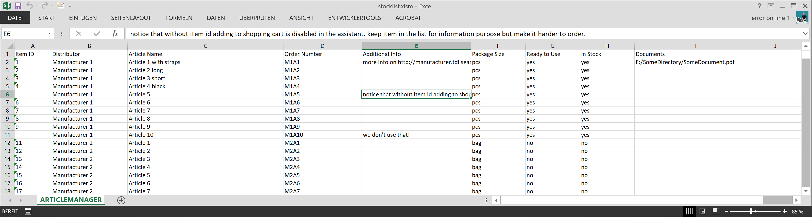
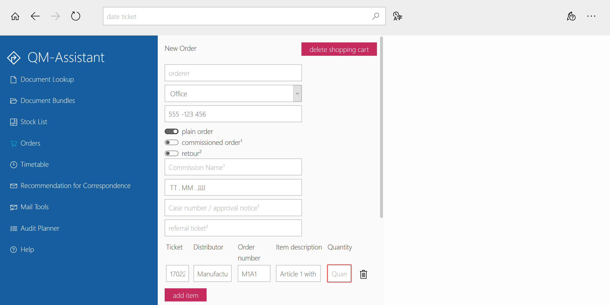

# bottle light quality management software

```
      m
     / \    automate your paper based qms with
    |...|
    |...|   bottle light quality management software
    |___|   by error on line 1 (erroronline.one)
    / | \
```

[](https://github.com/erroronline1/qualitymanagement/commits/master)


[](http://erroronline.one/column3/aqms/assistant/QM-Assistant.html)

compatible with


## table of contents

* [use case](#use-case)
* [about bottle light qms](#about-bottle-light-qms)
* [key features](#key-features)
* [the core documents](#the-core-documents)
	* [use case](#use-case-1)
	* [what the documents do](#what-the-documents-do)
	* [requirements](#requirements)
* [the assistant](#the-assistant)
	* [use case](#use-case-2)
	* [what this tool does](#what-this-tool-does)
	* [requirements](#requirements-1)
* [interfaces](#interfaces)
* [installation](#installation)
* [but i am no programmer!](#but-i-am-no-programmer)
* [details on the documents](#details-on-the-documents)
	* [template_file.docm](#template_filedocm)
	* [internal documents in force.xlsm](#internal-documents-in-forcexlsm)
	* [external documents in force.xlsm](#external-documents-in-forcexlsm)
	* [audit planner.xlsm](#audit-plannerxlsm)
	* [stocklist](#stocklist)
	* [ticketorder.xlsm](#ticketorderxlsm)
	* [data rights management.xlsm](#data-rights-managementxlsm)
	* [transfer schedule.xlsm](#transfer-schedulexlsm)
	* [vba](#vba)
		* [document_-modules](#document_-modules)
		* [admin_-modules](#admin_-modules)
		* [timetable_-modules](#timetable_-modules)
	* [thoughts and considerations](#thoughts-and-considerations)
	* [timetables](#timetables)
* [details on the assistant](#details-on-the-assistant)
	* [the access to your qm-system](#the-access-to-your-qm-system)
	* [provided modules within open-source distribution](#provided-modules-within-open-source-distribution)
		* [document lookup](#document-lookup)
		* [predefined document bundles](#predefined-document-bundles)
		* [inventory / stock list](#inventory-/-stock-list)
		* [orders](#orders)
		* [timetable](#timetable)
		* [default texts for correspondence](#default-texts-for-correspondence)
		* [mail tools](#mail-tools)
		* [audit planner](#audit-planner)
		* [help](#help)
	* [module structure](#module-structure)
	* [module functions](#module-functions)
	* [registering and loading of modules](#registering-and-loading-of-modules)
	* [module initialization](#module-initialization)
	* [multi-language support](#multi-language-support)
	* [smart search with fuzzy search](#smart-search-with-fuzzy-search)
	* [output usage](#output-usage)
	* [inter-module communication](#inter-module-communication)
	* [api](#api)
	* [core overview](#core-overview)
	* [merely a matter of form](#merely-a-matter-of-form)
* [thoughts and considerations](#thoughts-and-considerations-1)
	* [changes and updates](#changes-and-updates)
* [disclaimer](#disclaimer)
* [license](#license)

## use case
while it makes way more sense to automate quality management using assistive technology and digitalizing everything, this is not always possible. therefore bottle light quality management software possibly supports you if

* your quality managment and documentation is still mainly paper-based
* employees have access to the it-infrastructure and printers, e.g. via network and group-accounts
* your company relies on microsoft office
* there is at least one tech-savvy employee interested in getting things done

and you do not plan to change this within the near future.

this system has been in use in context to [iso 13485:2015](https://www.iso.org/search.html?q=13485%3A2015) and was approved by the certification authority.

[back to top](#bottle-light-quality-management-software)

# about bottle light qms
if your company does not have the ressources to test out different expensive qm-software-solutions until you find one to suit your needs and you somehow make use of the simple tools you have access to, bottle light qms might be a good start for you.
by using quite basic ressources like microsoft office word and excel and standard browsers it also is able to bypass weird system restrictions. editing (if necessary) can be done via any given text editor.
still this system support you with version control, archiving and publishing quality related documents and ressources.

```
      m
     / \    
    |...|
    |...|   bottle light quality management software
    |___|   by error on line 1 (erroronline.one)
    / | \
```
the name is inspired by [alfredo mosers bottle lights](https://www.bbc.com/news/magazine-23536914) that have an extraordinary effect by combining ressources that have nothing in common in the first place. while bottle lights still make no electric light bulb they serve their purpose better than expected, illuminating thousands of homes with materials that presumably have nothing to do with illumination in the first place.

while not expecting to influence as many lives as the real bottle light i do hope this software does a better job at supporting quality management as you would usually expect from word-, excel- and javascript-files, and dare to dream it might make a difference for someone.

and yes, whether or not i should use ascii to do a logo, i most certainly can.

## key features
* open source
* popular coding languages, amateur friendly 
* scalable
* strictly local, no internet connection necessary
* no external dependecies, frameworks, libraries
* minimal system requirements

[back to top](#bottle-light-quality-management-software)

# the core documents
## use case
the office documents come with built-in vba-code to handle document version control, ressource overview and export-handling. employees use mainly unchangeable pdf-files to fill out during workflow. each document registers and manages itself (kind of).

## what the documents do
style the blueprints according to your desired corporate design whatever you like and however word allows you to. just make sure you don't delete the in-built fields.
customize the variables within the vba-code.

in general this system
* supports your version control
* supports you being backed up at any time
* makes sure you took every aspect into account regarding the norm - modify and add checkpoints to your needs
* makes sure everyone has access to documents and functions you decide to is supposed to - in case your quality manager calls in sick there is still access to the system (as supposed to a software i saw whose document access was fully dependent on profile login and license number)
* supports free word design choices (as supposed to the aforementioned softwares styling limitations due to use of .rtf-templates)
* has a built in interface for general availability of information - data export to the assistant

## requirements
* one somewhat experienced office user to customize the document-blueprints and vba-codes
* microsoft office 2010+ (tested with office 2010, 2013 and 2019 professional, word and excel)

[back to top](#bottle-light-quality-management-software)

# the assistant
## use case
this tool serves as an assistive layer to access your companies documents in form of a web-app with read-only-properties.

## what this tool does
this tool provides your company with an application to have an easier access to your quality management system. if you provide your employees with access via this assistant it might be way more easy to have them use only the latest documentation version. it does access files that could be reached by file-explorer as well, but avoiding the latter way prevents the employees to make copies that may become obsolete, at least to some degree.

* global access to qm-related ressources for every employee
* easy lookup methods for finding documents, materials and orders regardless of storage path or restricted erp-access, in case alternative search term are provided it is even more easy to find these
* easy content updates directly from the provided vba-interfaces
* compatible to ms ie11 because it was built for it, tested successfully with firefox, chrome and edge as well
* easily extendable with modules for various custom data automation

## requirements
* one webdeveloper to customize the application for your companies needs and optionally provide you with desired additional modules
* network access for every employee to access the assistant only from one source
* serial print of document packages requires active-x which is only available in ie11. this option will not be shown if not accessible. edge with chromium engine is said to be [supporting an ie11 mode](https://docs.microsoft.com/en-us/lifecycle/faq/internet-explorer-microsoft-edge#what-if-my-enterprise-line-of-business-lob-application-has-a-dependency-on-a-version-of-internet-explorer-that-reached-end-of-support), but it might be somewhat cumbersome to achive this if you don't have a decent access to company settings. actually i am not able to test it. also you might have to decide either for serial print or more storage space (active-x and cookies vs none but localstorage).
* patience with coworkers blaming 'your' assistant for every network failure, printer settings and their inability to read the literal hints and descriptions

[](http://erroronline.one/column3/aqms/assistant/QM-Assistant.html)

[back to top](#bottle-light-quality-management-software)

# interfaces
some core documents contain vba-code to translate their content to a javascript object to be accessed by the assistant. there might pop up some python scripts occasionally to fulfill the same task for one or the other use case. these scripts will likely be configurable via a json-setup-file even after compiling. so there might be another dependency of a json-enabled python-dev.

[back to top](#bottle-light-quality-management-software)

# installation
there is no installation routine. place the files to your desired accessible network-folders and customize them by hand. create or recreate your documents with the provided template_file.docm and let the workflow guide you through the registration.


* the provided folder structure might not be neccessarily your first choice and serves just as a sample. you have to change at least the default paths within the vba-code and the assistant anyway.
* even if you don't want to use the assistant, the documents semiautomated version control still might be useful for you. on the other hand the assistant is hardly possible to populate without the documents unless you write your own routines for that.
* i'd recommend an educated access-management. it may be a good idea to store docm-templates in a folder with restricted access to qm-managers, deputies and ceo, while access to pdfs, timetables and the assistant application should be granted for everyone.
* provided python-scripts probably will have to be compiled (unless you have python installed - [3.6 for the moment](https://www.python.org/downloads/release/python-3612/)). i recommend [pyinstaller](http://www.pyinstaller.org/) for this usecase - at least for windows environments.

[back to top](#bottle-light-quality-management-software)

# bUt I aM nO pRoGrAmMeR!
to customize this software to your needs it is definitely neccessary to have someone change values within the vba-code- and the javascript-configuration files. you might at least know someone who does this as a hobby and is happy to do that for you for a couple of drinks. or after these...
i was hoping to have done enough documentation and commenting, so maybe you might as well get a grasp on changing the setting-files yourself. 
**on the bright side everything is open source and can be maintained by any programmer/webdeveloper/webdeveloping agency that does javascript and knows how to access the visual basic editor via the office developer tab!**

if you are a programmer i can recommend [notepad++ portable](https://notepad-plus-plus.org/download/) out of personal experience  in case you have restricted access to your it. also [git portable](https://sourceforge.net/projects/gitportable/).

[back to top](#bottle-light-quality-management-software)

# details on the documents
## summary
the vba-code can be customized quite easily for i tried to have all important parts split to functions and modules to be able to enable/disable these on demand as well as using variables to customize easily. in the best case all you have to do is to change the variables within the locals-modules. office-documents contain basically just functions to import outsourced modules and event handler. set up language and location of modules and you are almost ready to go. 

* customize the variables for prompts to your language
* you can provide default paths within the code - but paths will always be selectable
* you can change rows and columns within the local-setup of tables in case you want to provide different information on save of office-files
* you will be guided through version control and can choose whether to auto-update version and release date or set these manually
* archiving files with latest version number
* exporting files to unchangeable pdf (you might want to overhaul them to editable forms, but that requires additional software)
* updating the list of current documents in force
* central code modules makes changes to desired behaviour more easily

on save of excel-lists
* there will be an automated check if you have your documents fitting to all queried aspects
* you will be asked if you want to export/update the files list for the assistant application

*be aware that word 2019 has a different format output of doc- and pdf-files. this may lead to differing page-numbers registered to the list of documents in force and actual page-numbers in the accessible pdf-files.*

### why excel though?
it's widely agreed upon that excel does not serve as a sufficient database. on the other hand most people are experienced with excel to the degree where they do not have angst starting the application. it is available on most business setups and definetly more easy to handle and customize than ms access. if your datasets of documents in charge exceed excels capabilities your qm-system got out of hand anyway. if your stocklist exceeds excels capabilities you certainly did not bothering reading to this point anyway because of using a more sufficient software for this. or it got out of hand as well. in this case you probably should tidy up. huge data loads can be handled by the provided stocklist-script but require a decent csv-dump by your erp-software.

[back to top](#bottle-light-quality-management-software)

## template_file.docm
the main template contains the basic functions for importing modules for version control and registration. you basically just have to set up the language code according to available local modules and the level of parental folders depending on the relative vb_library location. this is one level up by default.
outsourced modules will be imported/updated if available.

there are three important and processed fields within the document:
* title, which is updated on load of the file
* version and
* release date

the field for page numbering is of no importance to the functions and can be deleted or moved.
according to the modules currently you are asked on saving if you want to update the version number and release date. you can set these automatically to the next version and the current date or set it manually. in either cases you will be processed through archiving, publishing and registering the document in the list of documents in force. if you have to do changes, don't want to change the version but want to export it (e.g. when editing with set release date) you will have to set the variables manually to the current state. if you cancel the initial request the file will be saved without version control.
you can archive the document without code to avoid any accidential changes. the file name will be followed by the version number.
you can publish the document as an uneditable pdf file (but you could implement editable field with third party application).
afterwards on selecting the list of documents in force, the file will either add itself to the list or update its version, release date and number of pages.

*auto-save makes the popup of version control a bit annoying from time to time. at least i was able to reduce the request to the active document only.*

[back to top](#bottle-light-quality-management-software)

## internal documents in force.xlsm
tl;dr: docm-files as working draft will register and update their version in this table. assign checkpoints to have a regulatory context. this list serves as the interface for the documents module for the assistant too. export will be executed on save. the list of norm-chapters should contain all relevant considerable chapters. on save documents will be assigned back to the list to clarify if every chapter is met. assign documents to regulary common used bundles. this also serves as the interface for the assistants bundles module. export will be executed on save.


this file contains all documents in force, a link to the documents and the possiblity to assign their special task in fullfilling regulatory requirements. the docm-documents will register themselves in sheet one on their individual save. you can assign alternate search terms and checkpoints to the document. sheet two contains these checkpoints and all the assigned documents. in this way you can see directly if you match all checkpoints.

*as the docm-files register and update themselves, there is no checkout for documents that expire or go out of use. you will have to delete these lines manually*


you can assign the documents to bundles in the third sheet where you have special use cases to use some of the documents everytime. this works similar to the assignment matrix for checkpoints. you can choose from your own documents or insert different paths to external files.


on save the list of checkpoints will update (for the dropdown option in assigning in sheet one) and all documents assigned will be written beside the checkpoints in sheet two. checkpoints on sheet one will be considered based on the header row. the list of documents for bundle assignment updates itself (insertion and deletion) and the bundles will be written like in the first sheets.
you will be prompted for exports. first step is to export the list without code for your colleagues without the risk of them messing something up. you will have to input paths to be replaced and the equivalent insertions. you can set default paths for export and replacements within the code to speed these things up. docm-links will be replaced with pdf-links and the document bundle matrix will be updated with links as well. *the resulting file might work as your backup plan in case the assistant is broken. or you do not want to use it ( not recommended ;) )* 
afterwards you can export the list of documents as well as the document bundles to the assistant. if you skip the first prompts the replace/insertion path will be asked for later. as long as the file is open the inputs will be remembered.

[back to top](#bottle-light-quality-management-software)

## external documents in force.xlsm


tl;dr: this list serves as an overview of acknowledged external documents in use as well as the interface for the assistants document module on save.

this list contains external documents in force and can contain other file lists. beside having them registered you can export these as well to the assistant on saving. while inserting links as registration there might be relative paths. this can be tweaked within the code where you can assign replacements to tidy things up. adding another sheet of file categories is easily done by adding another collection within the code, alter the sheet name and pass the collection to the export sub. remember to register the data-export to the assistants module as well. you can define alternative search terms as well as descriptions to filenames or urls to be displayed in the assistant in case the original files and urls lack a meaningful name.

[back to top](#bottle-light-quality-management-software)

## audit planner.xlsm


the audit planner can be filled with a question set for internal audits. by exporting the list to the assistant the question set can be used to generate or customize the annual questionnaire (to the relief of the quality manager) and becomes accessible to the employees to reduce obstructions due to regulatory vocabulary.

*please be aware that there are dependencies between column numbers and entries and the assistants filter function. the excel-list will be displayed in the same way within the assistant in the first place.*

[back to top](#bottle-light-quality-management-software)

## stocklist


the stocklist might contain all products and materials that have permission from the companies head. i am aware there are better solutions for stock administration but by time of writing my own companies software is worse than using excel for that. so this *is* an advance. the export function on save makes the list accessible and searchable for all employees using the assistant hence optimizing dialogue with inventory control. excel might freeze on export if the list contains 6k+ items, but it just takes some time, so no worries.


having two databases to maintain is admittedly not be the best solution. fortunately i found a solution to translate the dump from the erp-software to the assistant. in this scenario you will have to customize the json-setup-file and probably compile the python code to an executable that suits your operating system.

also this script has a function to split the data by given column values. this might help e.g. in case of annual stocktaking. this is not related to quality management in the first place but can come in handy and since the same source has to be processed by the same rules, why the heck not?

[back to top](#bottle-light-quality-management-software)

## ticketorder.xlsm
this files purpose is purely for translation. it serves as an interface between your erp-software with item orders and the assistant. basically you can insert any data dump by the erp-software and it translates it to a javascript-object-file as a feedback loop for the tickerorder-module within the assistant. it makes sense to contain the generated ticket-ids within the order process in any field that might be dumped by the output. this definitely has an effect on yout order process but might make communication more easy between inventory control and ordering persons.
*be aware that the pattern recognizing regexes in the imported vb_library/administration_Locals_XX.vba rely absolutely on the generated data by your erp-software and have to be customized to your individual situation!*

[back to top](#bottle-light-quality-management-software)

## data rights management.xlsm


this is a easy to handle list to set optional permissions for modules of the assistant as required. the password hash can be obtained by the assistant directly. no clear passwords are stored - in the image for illustration purposes though.

[back to top](#bottle-light-quality-management-software)

## transfer schedule.xlsm


like the [timetables](#timetables) this is not originally part of quality management, but on the other hand which part of operations is not somehow influenced by and influencing quality management itself? making use of the same codebase the transfer schedule originated from the schedule of transferring apprentices through the different departments to get an insight on everything. this might come in handy for other planning operations as well. note that this document is not within the registration process and exporting the table as a pdf-file will only contain a release date, not a version number.

customize the department definitions and abbreviations, everything separated by a non-word-chracter will be recognized to update to your set background-colour. plan the schedule, connect cells and you end up with a decent overwiew. on saving the background color of the entries as well as the separation lines for entries and months will update and you will be prompted to optional export the file.
change the year as needed, the first month-column contains the initial month value to start from within a formula. adding more sheets is possible, only the active sheet will be processed. position of the term "Legend" (customizable within the Locals module) and placing of the department definitions in column A is crucial.

[back to top](#bottle-light-quality-management-software)

## vba


the tables and documents will retrieve their vba code from here as they intrinsically contain not much more than import functions and basic settings of language and relative path to the vba_library folder as of january 2020 (major refactoring!).
the files are prepared to work on their own if no import file is found. after import modules are installed and only overwritten if the remote files are found next time opening.

supplying the source folder has the benefit of changes affecting all working draft documents automatic. be careful as well as glad changes have to be only done in one location mostly. yay!

hopefully settings have to be done within the locals-modules only. here you can customize columns and rows in case you slightly edit the tables structure but not the behaviour, customize some values and language chunks. if you copy any locals-module you can set up additional languages that will be accessed as soon as the language is set within the office files directly. just make sure to keep  Attribute VB_Name = "Locals" 

while serving for illustratory purposes in the first place all ..._illustration.vba-files have a secondary functional purpose as well.
if you have to change code for the main module / ThisDocument-class, there is a module prepared that will import the source code from the Document_ThisDocument_illustration.vba to overwrite, that you can implement (preferably temporary) from within the essentials-module. use case: changing paths, language or adding custom subs or funtions.

### document_-modules
these are the modules for word-documents like the [draft documents in force](documents/), containing versions control, publishing and registering.
Events like Document_Open() and App_DocumentBeforeSave() in the ThisDocument-code-module point to public functions within the essential-module thus executing always the latest imported routines.

### admin_-modules
these modules are in use of the [administrative excel sheets](administration/) for maintaining and exporting diverse lists like document-lists, stocklist, etc. reusable functions can be found in the essentials-module, special behaviours are in the explicit module (based on the filename).
Events like Workbook_Open() and Workbook_BeforeSave() in the ThisWorkbook-code-module point to public functions within the essential-module thus executing always the latest imported routines.

### timetable_-modules
these modules work like the document_-modules and serve the same for every accessing [timetable-file](timetables/). in this sample structure these can be found within the timetable-folder, but this is up to you. just make sure to point to the right directory from the ThisWorbook-code-module.
Events like Workbook_Open() and Workbook_BeforeSave() in the ThisWorkbook-code-module point to public functions within the essential-module thus executing always the latest imported routines.

[back to top](#bottle-light-quality-management-software)

## thoughts and considerations
on export of docm-files to pdf the file dialogue does not show pdf files. you will be asked to provide a file name with default docm-extension that will be changed automatically. this is due to the fact that vba `Application.FileDialog(msoFileDialogSaveAs)` does not support `.Filter`. existant files will not be displayed and just be overwritten.

[back to top](#bottle-light-quality-management-software)

## timetables


timetracking with excel as an addon. not quite related to quality management in the first place but can come in handy and is implemented in the general process surface of the assistant as well.

**unfortunately the excel-functions and sheet-code-names are german only for me having no access to an english environment. you have to translate them to your language if necessary. take account of sheets, conditional formatting and modules. marking weekends might have to be adjusted by changing the current values of "sa" and "so" to your language environment abbreviations in formula of conditional formatting.**

**be aware that this is currently in a permanent beta-status due to my lack of vba-skills and the sheets awaiting confirmation by the highly excel skilled personnel board possibly making spontaneous changes necessary. also these files (read: me) sometimes have difficulties dealing with different os- and office-versions.**

### there might be better solutions
if you have efficient electronic supported methods for time tracking of the employees or no need to track working time at all, please carry on!

### i come from worse
until the end of 2019 we kept track of work time on paper. every employee wrote down starting and ending time as well as breaks, had to calculate everthing at the end of the month and supervisors had to keep track of umpteen sheets, recalculate these and make sure all employees came for the work hours they were paid for. keeping track of their own timetables meant infinite paper copies of past sheets. and in the end it was all about trust. and possible misuse.

### welcome to the 21st century
this is where automation might be beneficial. following the idea of the [bottle light](https://github.com/erroronline1/qualitymanagement#about-bottle-light-qms) i decided for excel and did a neat excel timetable. as these are accessible through the assistant as well all sheets are accessible by all employees. this rose some concerns about the risk of manipulation by the human ressources so there was a additional security layer implemented.

### calculations
the sheets calculate the effective work hours within the month based on weekly hours, count working days and take several special cases in account to reduce these if necessary (weekends, holidays, sick leave, etc.). breaks are deducted by default according to german work laws, unless the registered breaks are longer than the required minimum. holidays are counted as well and subtracted from the annual amount. every sheet fetches the values from the previous month.
all in all every employee can look up exactly the state of current hours and holidays, can review all previous months and doesn't have to calculate everything manually.

### different models
currently there are two work model types: 9to5 and part time with home office. some calculations and excel-formulas differ, so there is a special handling within the vba-files.

* examples for 9to5: jane doe and max mustermann
* examples for part time with homeoffice: john doe and monika musterfrau

### automation
on start of a new month a new sheet is added automatically, so no one has to care about that. in this case there will be also a (monthly) reminder to plan paid leave if there are too many holidays left in relation to remaining days of the year.

as of 7/20 manually adding a new sheet is prohibited to prevent the initialization wizard from starting because it does not find a set date on the last sheet. 

on first opening of the file the user will be prompted to initialise the sheet. this will update the initial sheet to the current month and write the latest hours and holidays to the table. afterwards the user can personalize additional information within the sheet and start tracking. all surrounding information but the time and holiday entries will be copied to the next month, so there is no need to insert it regularly.

*there are formulas that have to be written to the new monthly sheet by vba. remember to change these too as you change formulas in the sheets. local tinted formulas (eg "wennfehler", ugly german for "iferror") can be found within the locals-module and update on initialization and while adding new sheets. all other formulas are simply arithmetic.*

### security
the sheets are protected by default, only relevant cells can be changed by the user. on the first change after opening the user will have to enter a password. if this is not set already a personal password can be chosen. if forgotten a new one can be chosen as well. there will be no prompt until the next opening of the document. this reduces the risk of manipulation by accident or other employees.

### don't tell anyone
the security is inversely proportional to the tech savvyness of the users. there is a very hidden sheet containing the masterpassword to unlock and relock sheets while initializing or creating the monthly sheet.
here the user passwords are stored as well, complemented by timestamp of creation and user account. in case of integrity concerns these information might give a start for investigating. if you consider enhancing security protect the vba code with a password as well, but ponder on tech savvyness of employees vs. long term accessability even after you leave the company with the passwords...
this sheet is also used for session persistent values that can not otherwise be handled due to vbas behaviour.

### maintainability
i had to learn this one the hard way. on developing and testing i had to change the codebase several times in about 30 beta testers sheets without dumping their values. eventually i learned about importing modules. if you provide a subfolder with the main module codes these will be imported/updated on every opening of the sheet. if this is not possible the modules remain in their last imported version. you can hide the subfolder vb_library, make it read_only by account management or provide it temporarily after changes.
the code within This.Worksheet can be overwritten by enabling the *Rewrite*-module from the *Essentials*-module. this works well, but causes issues for tables that have to be initialized. please enable this only to update existing timetables on the fly and disable afterwards to not affect the daily flow.

if you change the layout of the tables make sure to adjust the cell addresses (A1 nad R1C1 notations both apply) within the essentials-module:

settings:
* addresses of settings in Essential.persistent
* columns of password storage in Secure.passwordHandler

info-sheet:
* address of absenceList for updating in Essentials.updateAbsence

timetable-sheets:
* columns of date, days and absence in Essentials.absenceHandler
* rolumns and rows for day counting in Essentials.countDays
* addresses of cells to be set plus formulas in Essentials.init
* addresses of cells to be set, read plus formulas in Essentials.addSheets
* addresses of cells to be read in Essentials.holidayReminder
* addresses of cells to reset with local formulas and conditional formatting in Locals.updateXLSfunctions

### flaws
opening the file for the first time from the web or a network path will excel be loading it in protected mode. this causes an issue that can only be bypassed by reopening the file for excel will trust the source from then on. there will be an information about this, as this was the easiest way after several insufficent tries to handle this (leaving protected mode delays unprotecting after initializing code. there is no application.wait available coming from protected view).

passwords are stored in plain text. whether you like that or not, it makes it a lot easier to track possible vulnerabilities and editing sheets.

all this might not satisfy all security concerns but is considered reasonable.

adjustments within the trust center might be necessary.

there might be errors on opening multiple timetables at once, most notably with excel 2010. i still haven't learned why. all tests succeeded being used solo. field test showed errors and crashes sometimes, most probably due to faulty input, resulting in loss of a few inputs. i still have no clue what the colleagues entered to lead to this behaviour. you're most welcome to educate me on this!

on opening the file for initialization from the assistant, the wizard will be hidden beneath the browser that has to be minimized first.

[back to top](#bottle-light-quality-management-software)

# details on the assistant
## summary
there is a main html-file in the root folder, a core folder with the core function framework, a config-file and themes. then there are module- and data-folders where you can define modules with any desired javascript-functionality to automate things. everyone has access to these and can make use of them. therefore any employee has the same ressources and hopefully outputs. note that the current version makes excessive use of the [vanillaJS-library](http://vanilla.js-com).

[](http://erroronline.one/column3/aqms/assistant/QM-Assistant.html)

* the assistant is built using js-ecmascript 5 on purpose because of required compatibility to ms ie11. unfortunately this still is the default browser to date in many companies. the css is not compatible to previous versions of ie. there might be browserhacks and polyfills.
* the assistant is designed to handle multiple language support, comes with english and german and can be extended as desired. extend the lang-objects in every module, the config-file and register the languages in this config-file to make them available.
* the core-object provides (hopefully) readable function-calls and globally usable variables. general configuration takes place in library/core/core.var.js. this file contains a variable that extents the core-object with global variables and commonly used language-bricks.
* built-in core-functions provide a search-function that has multi-word and fuzzy-search handling, language-handler, script-import, local-storage- or cookie-handler, repetitive design pattern implementation (icons, inputs, etc.), history handling and some more. get access or extend these functions with `core.fn.FUNCTIONNAME`, global variables with `core.var.VARNAME`. i recommend this pattern to modules as well, defining a module-object with `{moduleFileName}.fn.FUNCTIONNAME` and `{moduleFileName}.var.VARNAME`. the handler for multi-language-support of the application  (`core.fn.lang()`) makes built-in automated use of this pattern.
* data files are stored in a different folder hoping that changes to the backend don't mess up data that might be accessed through different persons than the maintainer of the application. these are separated in module-variables that define the modules behaviour and module data that will be processed according to the modules task. the latter are optional.
* users can be informed about changes using the changelog in library/core/core.userDialogue.js. add your own changes and the information will popup automatically on start.
* since most of my colleagues don't mind messing around to learn something, there is a short-tip function whose entries can be extended in accordance to your modules.
* settings will be stored in local storage or cookies (depending on browser support) so everything depends on the local machine in addition to user login. in case everything is stored with cookies if the browsers history is cleaned on exit all setting will be gone as well. the storage method handles local-storage support with cookies as a fallback. this means there is support for chrome having an issue with cookie storage of local sites as well as ie11 not having local storage for local sites. cookie storage is somewhat inconvenient small, but this is due to browser dependent handling of local sites. unfortunately edge as well can be set to delete everything on exit using a company policy that can may be not be customizable by the user.
* you can monitor the performance (currently implemented for tracking asynchronous loading and processing) in the console if you enable it in the settings.

*be aware that there are dependencies between the assistants datafiles, their objects and handling, and the documents vba and table-structure. it might become neccessary to change things on both sides.*

## the access to your qm-system


[back to top](#bottle-light-quality-management-software)

## comes with different themes


## search less, find more directly from the home screen


## customize the assistants behaviour


[back to top](#bottle-light-quality-management-software)

## provided modules within open-source distribution
the provided modules are filled with dummies. the general multi-language support was added in advance of making this application open source and comprehensible. some module-data-files might lack of multi-language content. in production this feature might or might not make sense. you are free to implement this feature for your self.

### document lookup


you can search for documents by name, switch between your own and foreign or other documents. there is a third category of documents of proof that might not neccessarily have to be in version control. these are not searchable but still reachable from the application.
every klick on a document will be counted. from the second call of this module on the last used documents will be displayed. frequent called documents will appear on the top of the list. you can define default documents, users will be able to define their own default list, delete and recall lists. if you define default lists within the module set up the documents filename only without non-word characters.

dependencies are: datalists for internal and external an other documents. these are generated by the excel-file of documents in force.

globalSearch api: returns documents from all categories/datalists that fit search terms.

[back to top](#bottle-light-quality-management-software)

### predefined document bundles


if you have reaccuring sets of documents it might come in handy if you define packages that can be selected, displayed and (using ie11) printed on the fly.

dependencies are: datalist for packages. this can be generated by the excel file of documents in force. if you mess around with exceptions there might be changes within the macro neccessary as well.

globalSearch api: returns packages that fit search terms.

[back to top](#bottle-light-quality-management-software)

### inventory / stock list


if you want your employees to have a look at approved products and materials for your company and let them keep in touch with the inventory control this module makes it quite easy to look up all products.

dependencies are: the datalist of inventory and an excel file containing the original data exporting everything OR the stocklist-script. the displayed data is sorted according to the excel-lists column organisation or depends on the order of the erp-dump. if something is changed here the filter-method might have to be adjusted. employees have the opportunity to support inventory control via email and keep them updated.

globalSearch api: returns number of matches regarding search terms.

[back to top](#bottle-light-quality-management-software)

### orders


this form supports all employees to create decent orders and send the resulting table to central purchasing by mail. if inventory control / central purchase makes use of administration/ticketorder.xlsm to serve data about the current order status the module.data-file will be sucessfully imported making it searchable from within the module as well as from the home global search.

since ordering things can be expensive for the company, orders can be registered by everyone but have to be verified by persons with respective permissions as managed in the core-drm methods. the same module serves to decrypt the generated verification code for central purchase.

dependencies are: the datalist of inventory regarding the shopping cart, optional datalist of current order status

globalSearch api: returns number of matches regarding search terms id datalist is available.

[back to top](#bottle-light-quality-management-software)

### timetable


this module gives access to excel based tracking of working hours. the entered name will be converted to a local file link. entries make it to a favourite list. all timetables have to bear the input name (lower case).

dependencies are: timetables within one defined folder.

globalSearch api: returns a link to the module if first search term can be found in possible search terms. additional search terms lead to an unchecked link to a timetable.

[more on the timetracking](#timetables)

[back to top](#bottle-light-quality-management-software)

### default texts for correspondence


define default text blocks that you can use for standard letters so your company speaks consistent and no one has to think about wording for hours. you can define your default letter template to be accessible directly from this module to copy the texts on the fly.

dependencies are: datalists for texts

globalSearch api: returns texts blocks where headers match the search terms.

currently i have no idea how to set this one up with an easy office interface because language synthesis is quite complex in this simple approach already. this module makes use of the `core.fn.languageSynthesis` properties within library/core/core.fn.languageSynthesis.js, adding new texts might require flexible additions to this core-function with all language support and in my company i am not sure about the ability to comprehend inserting $placeholders$ to a text. so currently adding meaning to this module will definitively need an understanding and editing of the code itself.

[back to top](#bottle-light-quality-management-software)

### mail tools


creating serial letters is an office feature, but sending almost the same email to different recipients while manually changing the salutation is not that much fun. automate this by using this module. all you have to to is to click on the created links one after another and send the emails.
you can also define the default email signature for your company and make everyone using it by just modifying their name, position and email-address. this function should be mostly outlook-webapp-proof.
in case you are out of office, with this module you can set up the starting and ending time of your vacation and will get the text automatically.

this module has a slightly different structure than the others and you have to make your configuration regarding language and content not only on the top of the file.

no dependencies for this module

globalSearch api: returns submodules where titles match the search terms.

[back to top](#bottle-light-quality-management-software)

### audit planner


this module prepares given data from the depending xls-sheet as a question setup for the internal audit. topics can be selected as a whole, manually or random. select the maximum number of questions per topic. this module might reduce the preparation time for the quality manager as well as giving all employees an impression how to think in terms of processes and norm-vocabulary.

dependencies: datalist for question sets. these are generated by the excel-file for audit planning.

globalSearch api: returns false because the contents are considered useless for a daily workflow and would mess the overall search results up unnecessary.

[back to top](#bottle-light-quality-management-software)

### help

(simplyfied for me not being english native) use this as an implementation to have your own modules and workflows documented. customize it to your own companies comprehension of interwebz and nerd-stuff-thingies.

dependencies are: datalist of help topics. these have to be written directly into the code.

globalSearch api: returns entries that match search terms.

[back to top](#bottle-light-quality-management-software)

## module structure
each module consists of an object with properties and methods. the initiating method should be the callback function of module loading with `core.fn.loadScript('modules/modulename.js','modulename.fn.init()')`. the overall structure of the modules data processing looks like this:

```Javascript
if (typeof modulename == 'undefined') var modulename={};

modulename.api= { //for globl search
	available: function(search){
		//stop performance monitoring that has been started by module calling
		core.performance.stop('modulename.api.available(\''+search+'\')');
		return somethingBasedOn(search);
	},
	processAfterImport: function(){
		//if you have to load something first this might be the callback function.
	}
};
modulename.function= { //module behaviour
	init: function(query){
		//highlight menu icon
		el('module{modulename}').checked=true; 
			el('module{modulename}').checked=true; 
		el('module{modulename}').checked=true; 
		//import data file if applicable, return initial module content, process query from inter-module communication or global search
		core.fn.loadScript(core.var.moduleDataDir + 'modulename.js', 'modulename.fn.someFunction(\'' + value(query) + '\')');
		//prepare your modules interface
		core.fn.stdout('input', 'your menu');
		core.fn.stdout('temp', 'your temporary output or additional forms');
		core.fn.stdout('output', 'your output');
		//stop performance monitoring that has been started by module calling and write history
		core.performance.stop('modulename.fn.init(\'' + value(query) + '\')');
		core.history.write(['modulename.fn.init(\'' + value(query) + '\')']);
	},
	someFunction: function(query){
		//optinal performance monitoring for each function
		core.performance.start('modulename.fn.someFunction(\'' + value(query) + '\')');
		
		//////////////////////////////////////////////////////
		//do your magic here
		//////////////////////////////////////////////////////

		core.performance.stop('modulename.fn.someFunction(\'' + value(query) + '\')');
		core.history.write(['modulename.fn.init(\'' + value(query) + '\')']);
	}
};
```

the folder data has to contain a variable-file for the module, that will be called automatically on module load.

```Javascript
if (typeof modulename == 'undefined') var modulename={};

modulename.var= { //module variables
	someProperty: 'Pi is exactly 3',
	lang: {
		inputPlaceholder: {
			en: 'Search for last digit of pi',
			de: 'Suche die letzte Stelle von Pi' 
		},
		otherShownText: {
			en: 'Add multi-language-support for all text chunks',
			de: 'Füge Unterstützung für mehrfache Sprachen für alle Text-Blöcke ein'
		}
	},
	//declare false if the output is meant to be copied and should be selected as a whole by clicking into the area
	disableOutputSelect: false,
};
```

thus algorithms and values are separated and changes on one don´t necessarily affect the other. or copying new content between my companies and this open source version don't overwrite something (that happend way to often). since both parts of module are loaded asynchronously the initialization of the modules object in both files might be reasonable.

please inspect the sample files for further information. while distributing this piece of software there happen to be some differencies between the open source version and the actual software used in my company. the main differencies can be found in the {modulename}.var-properties. maybe you find this suitable for you as well so changes to to sourcecode are way more easy to implement.

[back to top](#bottle-light-quality-management-software)

## module functions
modules must contain functions to generate the modules output. some functions are in the main or dependent scripts like language synthesis, shortened document.getElementByID() or loading remote scripts. make use of the core-object, some things are fairly prepared:

* data handling for inter module communication and storing settings
* html-escaping for urls and dynamic mailto:-method
* search algorithm
* language selection
* language synthesis as in replacing customizable keywords in strings
* asynchronous script loading
* insertion of repetitive html-elements (e.g. inputs) 
* insertion of inline svg

all modules are depentent on the main module, only some may have dependencies of other data-files.

[back to top](#bottle-light-quality-management-software)

## output containers
container for output are named 'input', 'temp' and 'output' and can be accessed preferably via `core.fn.stdout('input', content)` or `el('input').innerHTML` or whatever.

## registering and loading of modules
register and deregister modules in ROOT/core/config.js so they are accessible and listed on initial start. import js-files or other subscripts with `core.fn.loadScript(url, callback);` files to be imported always have to be hardcoded (e.g. dropdown-list) because javascript having no indirect access to local file system (directory-listing etc.). this has to be done within modules as well. data-objects should be stored in `core.var.moduleDataDir`-folder prefixed with modulename_. therefore these can remain untouched if any changes occur for the main module-file and won't be affected during file-transfers in reviews.

## module initialization
initialization of module will be achieved by the callback functions of the core.fn.loadScript-method. initialization should contain a default output for input (forms or explanatory text), might contain module information in temp and should clear output. even if the module-object is reinitialized on every module-call there is no way of initializing with the same function name because of some asynchronous variable handling or scope unknown to me resulting in calling the previous init-function and giving a lot of errors.

[back to top](#bottle-light-quality-management-software)

## multi-language support
the language bricks within the modules are to be defined. i recommend the same nesting and pattern than the core language model for easier source reading. within every module the language-blocks have to be filled up according to registered languages to avoid errors of undefined objects. the bricks can be called with `core.fn.lang('brickName','modulename')` and will return the block in the selected language.

## language synthesis
the root language model core.fn.languageSynthesis within the file library/core/core.fn.languageSynthesis.js can be extended through assigning an additional property within the module-file for example:

```Javascript
core.fn.languageSynthesis.property={
	registeredlanguage_1:['child male form', 'child female form', 'adult male form', 'adult female form'],
	registeredlanguage_2:['child male form', 'child female form', 'adult male form', 'adult female form']
	};
```

or

```javascript
core.fn.languageSynthesis.property={
	registeredlanguage_1:function(){/*todo*/ return value;},
	registeredlanguage_2:function(){/*todo*/ return value;},
	);
```

the former object structure absolutely makes sense in german. in english not really though but it is implemented that way, so if you want to reduce that you will have to make changes to the processing as well. you can make use of these properties by processing strings as e.g.

```javascript
'this is a text where the term $property$ will be replaced.'.replace(/\$(\w+?)\$/ig,function(match,group1){return core.fn.languageSynthesis.output(group1)});
```

the method handles the decision over values or functions on its own.

[back to top](#bottle-light-quality-management-software)

## smart search with fuzzy search
i have to admit i am a bit proud of this one. this method has to be handed over the raw query string and an object containing the searchable data. it then splits the query into whitespace separated terms, divides -filters and adds a concatenated query to an array of query options. fuzzy search is optional and can be enabled from the settings. if the query bits are set up the dataset will be checked for occurences of every bit. the results is a multidimensional array that can be displayed first in order of occurrences of different terms (if there are more than one) then of the data object. + will make mathing of all search terms mandatory, ? and * will override disabled fuzzy setting, so not really serving as wildcards but giving most probably more relevant results to users that are used to working with these. quoted terms will be looked for in this particular order strictly adding relevance.

[back to top](#bottle-light-quality-management-software)

## output usage
output text is selected on click by default. to avoid this add a property `disableOutputSelect = true;` to module.var. this is considered not to be implemented global through registered-modules for being dynamically mutable if desired within the module itself (e.g. see mailtools).

## inter-module communication
communication between modules is possible with use of localstorage or cookies. this has to be observed strictly, because of possible failures and dependencies of js-data-files. there might be spaghetti! use the `core.fn.setting` method and always make sure to have proper default and error handling in case of missing data. initiating functions of submodules partially accept queries to handle preselections.

## api
every module has to contain an api-method that returns some value (at least a `return;`). the api-module is called by the global search from the start site. lack of the api will result in errors. every registered module will be called even if the user has deselected it in the settings (so the user might get a feeling of content and meaning of modules and has a guaranteed meaningful access).

[back to top](#bottle-light-quality-management-software)

## core overview
a shortened overview of the core-functions that can be made use of in future modules.

### core.js
`el(v)` returns document.getElementById(v)

`value(v)` returns value of v or '' even if v is undefined. useful for function parameters.

`isIE()` returns boolean for browserhacks

`svgClassList()` polyfill for adding/removing classes to svg classList

`core.fn.maxMailSize()` tests whether the browser can handle the maximum body size for maito according to advanced settings

`core.fn.dynamicMailto(address, subject, body)` prefills mailto:-actions, opens mail-client and handles browser dependent maximum body size

`core.fn.escapeHTML(text, br2nl)` returns a string with escaped special chars for mailto anchors

`core.fn.stdout(where, what)` serves as a wrapper for output to innerHTML, but can be used for debugging easily by setting/adding 'console' to *where*

`core.fn.popup(text)` shows or updates a popup box if text is provided, hides it if function called with undefined value

`core.fn.growlNotif(text)` shows a short notification that hides after a set time if text is provided, hides it if function called with undefined value

`core.fn.toggleHeight(toggleel)` toggles the class list of given element to expand or shrink it

`core.fn.sortBySecondColumn(a, b)` sorts two dimensional arrays as paramter for sort()

`core.fn.smartSearch.lookup(userInput, dataBaseObject, additionalCondition)` compares raw user input to objects values and returns an array with matches ordered by relevance/multi matches on multiple query terms. handles optional fuzzy search based on overall application setting

`core.fn.smartSearch.relevance.init` initiates a property in case you want the search results to be separated by relevance

`core.fn.smartSearch.relevance.nextstep` inserts a line between steps of relvance and should be concatenated to the output

`core.fn.lang(block, args)` looks for properties oder property-functions within core or loaded module to return dependent on the chosen language. block is the property name of the to be displayed text block, args is optional for functions. module properties come before core properties.

`core.fn.languageSelection(event)` returns a set of radio inputs based on registered languages. event is optional and can be e.g. an onchange property of the radio button

`core.fn.loadscript(url, callback)` appends url-file to the header and calls the callback function. used for importing / loading modules and data-files

`core.fn.insert.checkbox(label, id, checked, additionalProperty, title)` returns a html checkbox that can be prechecked, event can be an onchange property or similar

`core.fn.insert.radio(label, name, id, checked, additionalProperty, title)` returns a html radio button that can be prechecked, event can be an onchange property or similar

`core.fn.insert.select(options, name, id, selected, additionalProperty)` returns a html select element that can be preselected, event can me an onchange property or similar. options have to be an object with optionId:[value,label]

`core.fn.insert.expand()` returns a html span that indicates whether an box is expanded or shrunken

`core.fn.insert.icon(icon, addclass, id, attributes)` returns an inline svg according to the declared properties within contained asset-object. addclass, id, and attributes are optional

`core.fn.setting.setup()` returns the content of the settings to display within the popup. all the other setting methods are for this primarily but

`core.fn.setting.switch(name)` toggles a setting to true in terms of off/false by default

`core.fn.setting.localStorage.api()` returns whether localstorage is available or not and cookies have to be used

`core.fn.setting.localStorage.remainingSpace()` returns the amount of remaining bytes for storing settings or whatever

`core.fn.setting.set(name, value, errormsg)` stores data in localstorage or cookie. in the latter case for about one year, errormsg is optional and customizable for the usecase in case storage limit is exceeded

`core.fn.setting.get(name)` returns the value of localstorage.item or cookie *name* or false

`core.fn.setting.isset(name)` returns boolean of existence of localstorage.item or cookie *name*. the getter might not be sufficient in case of actual 0 or false values

`core.fn.setting.unset(name)` unsets localstorage.item or cookie *name*

`core.fn.setting.clear()` resets the whole application

`core.fn.stringcompression.compress()` returns an uricomponent encoded base64 encoded string to save some bytes for storage of long strings

`core.fn.stringcompression.decompress()` reverts the base64 encoded string

`core.fn.drm.table(table)` returns a translated table according to data rights managament excel sheet

`core.fn.drm.createHash(string)` returns a hash based on argument string, consider concatenation of name and password to make the hash unique regarding data rights management

`core.fn.drm.searchHash()` returns true if hash is found in given hash table

`core.fn.drm.encryptToken(base36Timestamp, name, password)` returns an encrypted token

`core.fn.drm.decryptToken(hashTable, base36Timestamp, token)` returns true if decrypted hash is found in given hash table

`core.fn.init(query)` creates home screen

`core.history.write(point)` adds an array of callbacks to the history storage if the parameter differs from last entry. removes entries if new entry is added while havinge gone back

`core.history.go('back'||'forth')` yields through the history and processes the stored callbacks

`core.performance.start(track, group)` does start a console timer. starting a group is optional. this is called on every loadScript and should be ended within all callback functions.

`core.performance.stop(track, info, group)` does stop a console timer. info can be some desired result. ending group is optional. 

### ../library/core/core.fn.languageSynthesis.js
extends the core-object with the language synthesis. here you define textblocks that can be switched for $keyword$ within continuous text using the function `core.fn.languageSynthesis.output(block)` called by `'string'.replace(/\$(\w+?)\$/ig,function(match,group1){return core.fn.languageSynthesis.output(group1)})`

[back to top](#bottle-light-quality-management-software)

## merely a matter of form
i recommend not testing in production... this whole thing escalated a bit in regards of complexity. as this is a read-only application it is absolutely possible to adjust within a developement version and push to production later on. there might be some caution neccessary with overwriting the data-files but this is the reason for them to be stored within a different folder.

there are more modules used in my company but these are dependent to sensitive data thus there is no publication possible.

[back to top](#bottle-light-quality-management-software)

# thoughts and considerations
i tried to implement a preview on search forms using datalists. while it is not a big problem to update these dynamically i ran into two major issues: the cross-browser behaviour is very different and quirky. and using this in combination with fuzzy search and 6k+ items in stock-list slows everything horribly down. it would have been nice to have but ended up in some hours wasted.

by 6/20 it is possible to handle special permissions due to the data rights management. this is meant to be as secure as a read-only front-end security system can be. it is absolutely not uncrackable but hopefully a fair amount of obfuscation and obstacles. know your techies in case of abuse.

the assistant is designed to hopefully transition mostly seamlessly into windows 10 fluent design. styling and icon set was selected with this intention. i don't want to collide with foreign rights and hope this will be recognized as the reverence it is intended to be. i am not a fanboy in the first place, although i like microsofts os design. i just try to make it look as native as possible to not disturb the co-workers. it is hard enough to convince them to utilize quality management as well as this tool.

*funny what can evolute from a personal tool to generate standardized email answers to recurrent enquiries and some messing around with conditional formatting in excel.*

[back to top](#bottle-light-quality-management-software)

## changes and updates
this software is purposed to be adapted to the companies needs in an flexible way. if you find something missing you can add functions quite quick and easily (within technical boundaries). i do exactly this and want to keep the open source distribution updated as well. as long as i am not aware that this software is used by a third party i will push to master and will not implement any version management or branching.

i maintain this open template as well as the official version in my company. while making changes to the program i repeatedly have to consider the individual parts. therefore all custom files are to be found within the library folder. these are seldom a subject of structural changes. most parts are quite dynamic and feed off the data files. customization might not be neccessary. if you do not customize anything within the main files any update from the latest commits should work flawless.

[back to top](#bottle-light-quality-management-software)

# disclaimer
use at your own responsibility. as this system is or has been in real use with me being responsible, i did my best to make everything flawless. i also tried to make the documentation and comments as meaningful as i could. als always there might be parts that once seemed to be self-explanatory so a little bit of advanced javascript and vba skills might come in handy.

this system does neither provide you with the content of your quality management system nor the necessary structure. you will have to set this one up for yourself. but this system might be flexible enough to match your needs in regards of version control, publishing and company wide access. of course i sewed everything to fit my own companies needs and quality management system. if your company decides for more fields you might have to take a deeper look into vba programming to customize that.
but as the current deputy quality manager i strongly recommend to reconsider which type of information and extent your documentation must have to fit the norm.

i was not able to find information if there are special requirements for a quality management software. regarding iso 13485 there are no restrictions what to use. you will have to take your own responsibility for any kind of software - even an amateurs work. you will just have to rate the risk, how to handle that and set up the process of validation of software application for this. as this software supports your paper-based documentation it is up to your own document content, process definitions and reliable form completion by your employees to make sure your qm/documentation meets all regulatory requirements.

[back to top](#bottle-light-quality-management-software)

# license
bottle light quality management software

copyright (c) 2020  [by error on line 1](http://erroronline.one)

This program is free software; you can redistribute it and/or modify it under the terms of the GNU General Public License as published by the Free Software Foundation; either version 3 of the License, or (at your option) any later version. 

This program is distributed in the hope that it will be useful, but WITHOUT ANY WARRANTY; without even the implied warranty of MERCHANTABILITY or FITNESS FOR A PARTICULAR PURPOSE. See the GNU General Public License for more details. 

You should have received a copy of the GNU General Public License along with this program; if not, see [http://www.gnu.org/licenses/](http://www.gnu.org/licenses/).


i am happy to get feedback on code- and documentation-quality since this is my first official open source project.

[back to top](#bottle-light-quality-management-software)