# bottle light quality management software

```
      m
     / \    automate your paper based qms with
    |...|
    |...|   bottle light quality management software
    |___|   by error on line 1 (erroronline.one)
    / | \
```

[](https://github.com/erroronline1/qualitymanagement/commits/master)


## table of contents

### general
* [about bottle light qms](#about-bottle-light-qms)
	* [key features](#key-features)
	* [requirements](#requirements)
* [installation](#installation)
	* [but i am no programmer!](#but-i-am-no-programmer)
* [document management](#document-management)
	* [template files](#template-files)
	* [internal documents in force.xlsm](#internal-documents-in-forcexlsm)
	* [external documents in force.xlsm](#external-documents-in-forcexlsm)
	* [vb_libraries](#vb_libraries)
	* [thoughts and considerations](#thoughts-and-considerations)
* [document access - the assistant](#the-assistant)
	* [provided modules within open-source distribution](#provided-modules-within-open-source-distribution)
	* [structure](#structure)
	* [core functions](#core-functions)
	* [core overview](#core-overview)
	* [python wrapper](#python-wrapper)
* [tools](#tools)
	* [vendorlist.xlsm](#vendorlistxlsm)
	* [audit planner.xlsm](#audit-plannerxlsm)
	* [stocklist.py](#stocklistpy)
	* [ticketorder.xlsm](#ticketorderxlsm)
	* [data rights management.xlsm](#data-rights-managementxlsm)
	* [transfer schedule.xlsm](#transfer-schedulexlsm)
	* [timetables](#timetables)
	* [filter.py](#filterpy)
	* [leech.py](#leechpy)
* [thoughts and considerations](#thoughts-and-considerations-1)
	* [changes and updates](#changes-and-updates)
	* [disclaimer](#disclaimer)
* [license](#license)

# about bottle light qms
while it makes way more sense to automate quality management using assistive technology and digitalizing everything, this is not always easy being put into practice. therefore bottle light quality management software possibly supports you if

* your quality managment and documentation is still mainly paper-based
* employees have access to the it-infrastructure and printers, e.g. via network and group-accounts
* your company relies on microsoft office
* there is at least one tech-savvy employee interested in getting things done

and you are not able to change this in the near future.

this system has been in use in context to [iso 13485:2015](https://www.iso.org/search.html?q=13485%3A2015) and was approved by the certification authority.

if your company does not have the ressources to test out different expensive qm-software-solutions until you find one to suit your needs and you somehow make use of the simple tools you have access to, bottle light qms might be a good start for you.
by using quite basic ressources like microsoft office word and excel and standard browsers it also is able to bypass weird system restrictions. editing (if necessary) can be done via any given text editor.
still this system support you with version control, archiving and publishing quality management related documents and ressources.

```
      m
     / \    
    |...|
    |...|   bottle light quality management software
    |___|   by error on line 1 (erroronline.one)
    / | \
```
the name is inspired by [alfredo mosers bottle lights](https://www.bbc.com/news/magazine-23536914) that have an extraordinary effect by combining ressources that have nothing in common in the first place. while bottle lights still make no electric light bulb they serve their purpose better than expected, illuminating thousands of homes with materials that presumably have nothing to do with illumination in the first place.

while not expecting to influence as many lives as the real bottle light i do hope this software does a better job at supporting quality management as you would usually expect from word-, excel- and javascript-files, and dare to dream it might make a difference for someone.

and yes, whether or not i should use ascii to do a logo, i most certainly can.

## key features
* open source
* popular coding languages, amateur friendly 
* scalable
* strictly local, no internet connection necessary
* limited external dependecies, frameworks, libraries
* minimal system requirements

[back to top](#table-of-contents)

## requirements
* microsoft office (developed and tested with office 2013 and 2019 professional, word, excel and outlook, lower versions probably work as well, at some point company dropped office 2010 so i can not test it any longer)
* network access for every employee to access the assistant only from one source
* one somewhat experienced office user to customize the document-blueprints and vba-codes
* one webdeveloper to customize the application for your companies needs and optionally provide you with desired additional modules
* at best a python-developer for provided scripts, having heard of json and knowing how to regex
* patience with coworkers blaming 'your' assistant for every network failure, printer settings and their inability to read the literal hints and descriptions
* provided python-scripts probably will have to be compiled (unless you have python installed - [3.6 for the moment](https://www.python.org/downloads/release/python-3612/)). i recommend [pyinstaller](http://www.pyinstaller.org/) for this usecase - at least for windows environments - i just don't know about others.

[back to top](#table-of-contents)

# installation
* place files from the repository in your desired accessible network-folders.
* customize *.var.js and *_Locals\_\*.vba by hand.
* create or recreate your documents with the provided template_file.docm and let the workflow guide you through the registration.

adjustments within the office trust center might be necessary by trusting access to the VBA project object model. it might be necessary to disable read mode for attachments in ms word.

in case you use the python wrapper for the assistant i recommend creating a virtual environment within the assistants folder and compiling it from there for public use. customize the provided batch-file.

* python -m venv .venv
* .venv/Scripts/activate
* pip install -r requirements.txt
* python -m eel assistant.py html --onefile --icon html/favicon.ico

*it appears the compiling process evaluates javascript as well. i don't know for sure but during compiling word occasionally pops up for docm-files contained in data-lists. it may help to create these only after compiling.*


* the provided folder structure might not be neccessarily your first choice and serves just as a sample. you have to change at least the default paths within the vba-code and the assistant anyway.
* even if you don't want to use the assistant, the documents semiautomated version control still might be useful for you. on the other hand the assistant is hardly possible to populate without the documents unless you write your own routines for that.
* i'd recommend an educated access-management. it may be a good idea to store docm-templates in a folder with restricted access to qm-managers, deputies and ceo, while access to published pdfs or docms, timetables and the assistant application should be granted for everyone.

[back to top](#table-of-contents)

## bUt I aM nO pRoGrAmMeR!
to customize this software to your needs it is definitely neccessary to have someone change values at least within the vba-code- and the javascript-configuration files. you might know someone who does this as a hobby and is happy to do that for you for a couple of drinks. or after these...
i was hoping to have done enough documentation and commenting, so maybe you might as well get a grasp on changing the setting-files yourself. 
**on the bright side everything is open source and can be maintained by any programmer/programming agency that does javascript, vba and python!**

if you are a programmer i can recommend [notepad++ portable](https://notepad-plus-plus.org/download/) out of personal experience in case you have restricted access to your it. also [git portable](https://www.softpedia.com/get/PORTABLE-SOFTWARE/Programming/Portable-Git.shtml).

[back to top](#table-of-contents)

# document management
tested with


the office documents come with built-in vba-code to handle document version control, ressource overview and export-handling. employees use mainly unchangeable pdf-files or docm-files to fill out during workflow. each document registers and manages itself (kind of).

style the blueprints according to your desired corporate design whatever you like and however word allows you to. just make sure you don't delete the document variables.
customize the general variables within the locals-vba-code.

in general this system
* supports your version control or release dates (versioned or record documents)
* supports you being backed up at any time
* makes sure you took every aspect into account regarding the norm - modify and add checkpoints to your needs
* makes sure everyone has access to documents and functions you decide to is supposed to - in case your quality manager calls in sick there is still access to the system (as supposed to a software i saw whose document access was fully dependent on profile login and license number)
* supports free word design choices (as supposed to the aforementioned softwares styling limitations due to use of .rtf-templates)
* has a built in interface for general availability of information - data export to the assistant

it coincidentally but fortunately matches most of the [requirements for document control software noted here](https://www.smartsheet.com/document-management-system), except some recommended automations that still make sense being done manually for my companies usecase. 


the vba-code can be customized quite easily for i tried to have all important parts split to functions and modules to be able to enable/disable these on demand as well as using variables to customize easily. in the best case all you have to do is to change the variables within the locals-modules. office-documents contain basically just functions to import outsourced modules and event handler. set up language and location of modules and you are almost ready to go. 

* customize the variables for prompts to your language
* you can provide default paths within the code - but paths will always be selectable
* you can change rows and columns within the local-setup of tables in case you want to provide different information on save of office-files
* you will be guided through version control and can choose whether to auto-update version and release date or set these manually
* archiving files with latest version number or release date
* exporting files to unchangeable pdf (you might want to overhaul them to editable forms, but that requires additional software) or as protected interactive dynamic docms
* updating the list of current documents in force for versioned documents
* central code modules makes changes to desired behaviour more easily

on save of excel-lists
* there will be an automated check if you have your documents fitting to all queried aspects
* you will be asked if you want to export/update the files list for the assistant application

### why excel though?
it's widely agreed upon that excel does not serve as a sufficient database. on the other hand most people are experienced with excel to the degree where they do not have angst starting the application. it is available on most business setups and definetly more easy to handle and customize than ms access. if your datasets of documents in charge exceed excels capabilities your qm-system got out of hand anyway. if your stocklist exceeds excels capabilities you certainly did not bothering reading to this point anyway because of using a more sufficient software for this. or it got out of hand as well. in this case you probably should tidy up. huge data loads can be handled by the provided stocklist-script but require a decent csv-dump by your erp-software.

[back to top](#table-of-contents)

## template files
the main **template_file.docm** contains the basic functions for importing modules for version control and registration. you basically just have to set up the language code according to available local modules and the level of parental folders depending on the relative vb_library location. this is one level up by default.
outsourced modules will be imported/updated if available.

there are three important and processed document variables within the document:
* title, which is updated on load of the file
* version and
* release date

on opening the draft file a macrobutton will be inserted at the end. on doubleclick the versioning and publishing routines will start. the button will disappear on exporting and quitting the file.
you can set the version number and release date automatically to the next version and the current date or set it manually. in either cases you will be processed through archiving, publishing and registering the document in the list of documents in force. if you have to do changes, don't want to change the version but want to export it (e.g. when editing with set release date) you will have to set the variables manually to the current state. if you cancel the initial request the file will be saved without version control.
archiving the documents happens without code to avoid any accidential changes. the file name will be followed by the version number.
you can publish the document as an uneditable pdf file (but you could implement editable field with third party application), or choose to publish it as a protected docm with dynamic formfields and optional checkbox-dependent content.
afterwards on selecting the list of documents in force, the file will either add itself to the list or update its version and release date. it will add a mark as new version as well, that later will be handled by the list of documents for release notifications.

**template_file_record.docm** is for record documents only and lacks the documents version number. the important document variables also are
* title, which is updated on load of the file but can be chosen extra
* release date and
* version - but this must be set to false!

also a macrobutton is inserted. record-templates use the same codebase but differ in behaviour in case of version being false. they will not register in the list of documents in force, therefore not showing up within the document lookup in the digital assistant. as the name suggests these documents are for record only, e.g. management report, announcements or other types that do not necessarily need a version for not being critical in regards of regulatory requirements but should still meet the corporate design.

**template_file_record.xlsm** also solely serves as a template for record documents, where the content is mainly a long table by which word soon becomes laggy (e.g. employee lists, special inventory lists). for these files the displayed title is always the file name. on save you can choose a release date. these templates make use of the same codebase as the other admin excel files. if no specific module containing the file name can be found, the main module assumes the file being a record template. these files contain no document variables because excel apparently doesn't support that.


you can create interactive dynamic word-documents, that show content upon checking a box. this might be useful for manuals that show only relevant content.
to achieve this you’ll need a checkbox with an individual tag (e.g. “Tag”), found within the developer tools, and two bookmarks called “textTag” and “notextTag”. notextTag can contain a caption like “not applicable”.
a useful shortcut is ctrl + shift + f5 to set a bookmark for a marked paragraph.
* the contents are always shown in the draft document
* all possible contents are shown on pdf-export, but not the notext-ones. in this way is is always possible to mark the relevant paragraphs manually
* just the notext-ones are visible by default on published DOCM-documents. this saves paper, is more comprehensible but is mandatory to be prepared on the computer.

text inputs are possible as well and expand the content dynamically. you can use richtext-inputs as well. on export the published file will be protected against changes, just leaving you with the form-inputs.

published docm-files import a macro-module handling the checkbox-hiding-text-topic at the moment but could be extended in the future or by yourself according to your needs.

[back to top](#table-of-contents)

## internal documents in force.xlsm
docm-files as working draft will register and update their version in this table. assign checkpoints to have a regulatory context. this list serves as the interface for the [documents module for the assistant](#document-lookup) too. export will be executed on save. the list of norm-chapters should contain all relevant considerable chapters. on save documents will be assigned back to the list to clarify if every chapter is met. assign documents to regulary common used bundles. this also serves as the interface for [the assistants bundles module](#predefined-document-bundles).

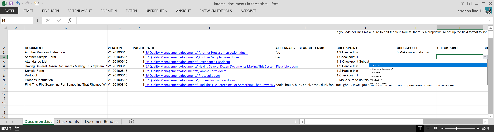
this file contains all documents in force, a link to the documents and the possiblity to assign their special task in fullfilling regulatory requirements. the docm-documents will register themselves in the first sheet on their individual save. you can assign alternate search terms and checkpoints to the document. the second sheet contains these checkpoints and all the assigned documents. in this way you can see directly if you match all checkpoints.

*as the docm-files register and update themselves, there is no checkout for documents that expire or go out of use. you will have to delete these lines manually*

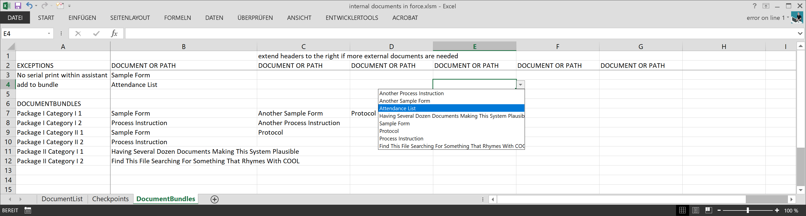
you can assign the documents to bundles in the third sheet where you have special use cases to use some of the documents everytime. this works similar to the assignment matrix for checkpoints. you can choose from your own documents or insert different paths to external files.

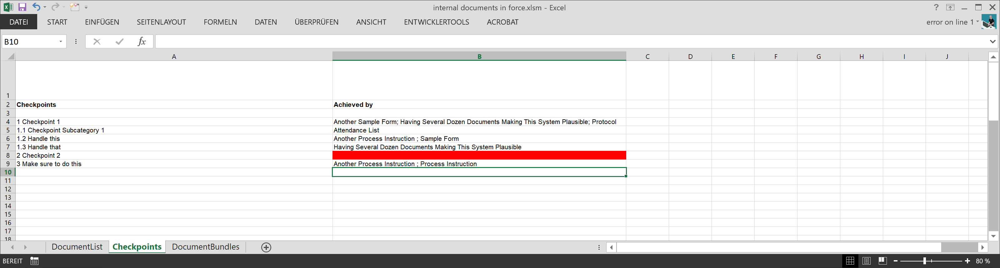
on save the list of checkpoints will update (for the dropdown option in assigning in sheet one) and all documents assigned will be written aside the checkpoints in sheet two. checkpoints on sheet one will be considered based on the header row. the list of documents for bundle assignment updates itself (insertion and deletion) and the bundles will be written like in the first sheet.
if you work direct within the list you will be prompted for exports, but not during registration of documents.
first step is to export the list without code for your colleagues without the risk of them messing something up. on new versions an email will pop up to notify about the recently changed documents and the respective mark left deleted. you will have to input paths to be replaced and the equivalent insertions. you can set default paths for export and replacements within the code of the locals-module to speed these things up. docm-links will be replaced with pdf-links if applicable according to the format column and the document bundle matrix will be updated with links as well. *the resulting file might work as your backup plan in case the assistant is broken. or you do not want to use it ( not recommended ;) )* 
afterwards you can export the list of documents as well as the document bundles to the assistant. if you skip the first prompts the replace/insertion path will be asked for later. as long as the file is open the inputs will be remembered.

[back to top](#table-of-contents)

## external documents in force.xlsm
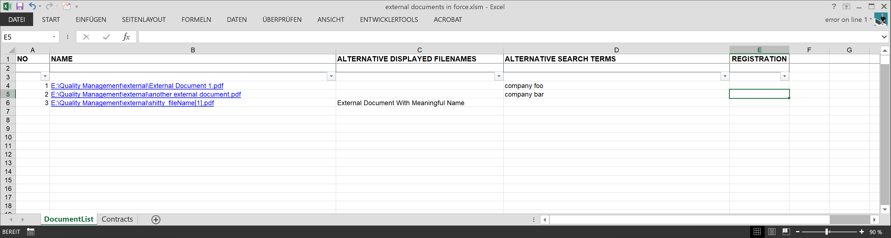

this list contains external documents in force and can contain other file lists. beside having them registered you can export these as well to [the assistant](#document-lookup) on saving. while inserting links as registration there might be relative paths. this can be tweaked within the code where you can assign replacements to tidy things up. adding another sheet of file categories is easily done by adding another collection within the code, alter the sheet name and pass the collection to the export sub. remember to register the data-export to the assistants module as well. you can define alternative search terms as well as descriptions to filenames or urls to be displayed in the assistant in case the original files and urls lack a meaningful name.

[back to top](#table-of-contents)

## vb_libraries


the tables and documents will retrieve their vba code from these folders as they intrinsically contain not much more than import functions and basic settings of language and relative path to the vb_library folders.
the files are prepared to work on their own if no import file is found. after import modules are installed and only overwritten if the remote files are found next time opening.

supplying the source folder has the benefit of changes affecting all working draft documents automatic. be careful as well as glad changes have to be only done in one location mostly. yay!

hopefully settings have to be done within the locals-modules only. here you can customize columns and rows in case you slightly edit the tables structure but not the behaviour, customize some values and language chunks. if you copy any locals-module you can set up additional languages that will be accessed as soon as the language is set within the office files directly. just make sure to keep the `Attribute VB_Name = "Locals"`. 

Document_ThisDocument.vba and Admin_ThisWorkbook.vba contain the code for the main module / ThisDocument-class. you can import the source code from the Document_ThisDocument.vba or Admin_ThisWorkbook.vba to overwrite, by implementing (preferably temporary) it within the essentials-module. use case: changing paths, language or adding custom subs or functions.

### document_-modules
these are the modules for word-documents like the [draft documents in force](documents/), containing version- or release-date-control, publishing and conditional registering.
events like Document_Open() in the ThisDocument-code-module point to public functions within the essential-module thus executing always the latest imported routines.
while being opened from the list of documents in force (programmatically by another office application) the window is not visible while the macros start. this results in errors using document variables.
there's a conditional query if the application is visible and warns about non available functions if true.

### admin_-modules
these modules are in use of the [administrative excel sheets](administration/) for maintaining and exporting diverse lists like document-lists, stocklist, etc. reusable functions can be found in the essentials-module, special behaviours are in the specific module (based on the filename).
Events like Workbook_Open() and Workbook_BeforeSave() in the ThisWorkbook-code-module point to public functions within the essential-module thus executing always the latest imported routines.

while being opened during a registration process (programmatically by another office application) office seems to have trouble adressing workbook-objects properly (or because of my poor skills). previously this could mess up the export of the list of documents, but is now prevented by remote calling a sub to set a respective flag.

[back to top](#table-of-contents)

## thoughts and considerations
on export of docm-files the file dialogue does not show pdf- or docm-options. you will be asked to provide a file name with default docx-extension that will be changed automatically. this is due to the fact that vba `Application.FileDialog(msoFileDialogSaveAs)` does not support `.Filter`. *existant files will not be displayed and just be overwritten.*

[back to top](#table-of-contents)

# the assistant
tested with


the digital assistant provides your company with an application to have an easier access to your quality management system. if you provide your employees with access via this assistant it might be way more easy to have them use only the latest documentation version. it does access files that could be reached by file-explorer as well, but avoiding the latter way prevents the employees to make copies that may become obsolete, at least to some degree.

* global access to qm-related ressources for every employee
* easy lookup methods for finding documents, materials and orders regardless of storage path or restricted erp-access, in case alternative search terms are provided it is even more easy to find these
* easy content updates directly from the provided vba-interfaces
* easily extendable with modules for various custom data automation


the assistant was initially created as a web-application run on internet explorer (still being the defacto standard in the beginning). in the meantime ie-support is finally ditched and the assistant comes with a python wrapper to compensate for rigid company policies regarding the deletion of browser history on closing.

you can start the assistant by opening the html-file, or using the (compiled or raw) python wrapper with passed --webfolder argument. use a bash/batch-file for convenience.  

* the current version makes excessive use of the [vanillaJS-library](http://vanilla-js.com).
* the assistant is designed to handle multiple language support, comes with english and german and can be extended as desired. extend the lang-objects in every module, the config-file and register the languages in this config-file to make them available.
* the core-object provides (hopefully) comprehensible function-calls and globally usable variables. general configuration takes place in library/core/core.var.js. this file contains a variable that extents the core-object with global variables and commonly used language-bricks.
* built-in core-functions provide a search-function that has multi-word and fuzzy-search handling, language-handler, script-import, local-storage- or cookie-handler, repetitive design pattern implementation (icons, inputs, etc.), history handling and some more.
* users can be informed about changes using the changelog in library/core/core.userDialogue.js. add your own changes and the information will popup automatically on start.
* settings will be stored in local storage or a userpath database (depending on pure or wrapper use) so everything depends on the local machine in addition to user login.

*be aware that there are dependencies between the assistants datafiles, their objects and handling, and the documents vba and table-structure. it might become neccessary to change things on both sides.*

[back to top](#table-of-contents)

### comes with different themes


### search less, find more directly from the home screen


### customize the assistants behaviour


[back to top](#table-of-contents)

## provided modules within open-source distribution
the provided modules are filled with dummies. the general multi-language support was added in advance of making this application open source and comprehensible. some module-data-files might lack of multi-language content. in production this feature might or might not make sense. you are free to implement this feature for your self.

### document lookup


you can search for documents by name, filter looking for your own and foreign or other document categories. content created by the office files has to be registered as lists. provided directories will be searchable using the python wrapper, albeit not with alternative search terms.
every click on a document will be counted. from the second call of this module on the last used documents will be displayed. frequent called documents will appear on the top of the list.

dependencies are: datalists for internal and external an other documents. these are generated by the [excel-files of documents in force](#internal-documents-in-forcexlsm).

globalSearch api: returns documents from all categories/datalists that fit search terms *or* recent selected favourites.

[back to top](#table-of-contents)

### predefined document bundles


if you have recurring sets of documents it might come in handy if you define packages that can be selected, displayed and occasionally printed on the fly.

dependencies are: datalist for packages. this can be generated by the [excel-file of documents in force](#internal-documents-in-forcexlsm). if you mess around with exceptions there might be changes within the macro neccessary as well.

globalSearch api: returns packages that fit search terms.

[back to top](#table-of-contents)

### inventory or stock list


if you want your employees to have a look at approved products and materials for your company and let them keep in touch with the inventory control this module makes it quite easy to look up all products.

to date inventory control and me were not able to agree upon and introduce use of the order module yet. so parts of the order module (which unfortunately is still disabled by default at my company) are integrated as a slimmed down version. the trouble with hope is it's hard to resist<sup>[\[1\]](https://www.youtube.com/results?search_query=doctor+who+that%27s+the+the+trouble+with+hope)</sup>, so i hope the colleagues might accidentally see the benefits of a structured order using the shopping cart being guided with necessary inputs and getting used to this, avoiding unecessary callbacks.

dependencies are: the datalist of inventory and an excel file containing the original data exporting everything OR the stocklist-script [more about that here](#stocklist). the displayed data is sorted according to the excel-lists column organisation or depends on the order of the erp-dump. if something is changed here the filter-method might have to be adjusted. employees have the opportunity to support inventory control via email and keep them updated.

globalSearch api: returns number of matches regarding search terms.

[back to top](#table-of-contents)

### timetable


this module gives access to excel based tracking of working hours. the entered name will be converted to a local file link. entries make it to a favourite list. all timetables have to bear the input name (lower case).

dependencies are: timetables within one defined folder.

globalSearch api: returns a link to the module if first search term can be found in possible search terms. additional search terms lead to an unchecked link to a timetable.

[more on the timetracking](#timetables)

[back to top](#table-of-contents)

### default texts for correspondence


define default text blocks to use for standard letters so your company speaks consistent and no one has to think about wording for hours. you can define your default letter template to be accessible directly from this module to copy the texts on the fly.

dependencies are: datalists for texts

globalSearch api: returns texts blocks where headers match the search terms.

currently i have no idea how to set this one up with an easy office interface because language synthesis is quite complex in this simple approach already. this module makes use of the `core.fn.languageSynthesis` properties within library/core/core.fn.languageSynthesis.js, adding new texts might require flexible additions to this core-function with all language support and in my company i am not sure about the ability to comprehend inserting $placeholders$ to a text. so currently adding meaning to this module will definitively need an understanding and editing of the code itself.

[back to top](#table-of-contents)

### mail tools


creating serial letters is an office feature, but sending almost the same email to different recipients while manually changing the salutation is not that much fun. automate this by using this module. all you have to to is to click on the created links one after another and send the emails.
you can also define the default email signature for your company and make everyone using it by just modifying their name, position and email-address. this function should be mostly outlook-webapp-proof.
in case you are out of office, with this module you can set up the starting and ending time of your vacation and will get the text automatically.

this module has a slightly different structure than the others and you have to make your configuration regarding language and content not only on the top of the file.

no dependencies for this module

globalSearch api: returns submodules where titles match the search terms.

[back to top](#table-of-contents)

### regulatory tools


this module (formerly known as audit planner) prepares given data from the depending audit planner-xls-sheet as a question setup for the internal audit. topics can be selected as a whole, manually or random. select the maximum number of questions per topic. this module might reduce the preparation time for the quality manager as well as giving all employees an impression how to think in terms of processes and norm-vocabulary.

also a search option for imdrf codes for the report of adverse events by the prrc is included. fortunately the [imdrf-website](https://www.imdrf.org/documents/terminologies-categorized-adverse-event-reporting-aer-terms-terminology-and-codes) provides json-files that have to be altered by name (e.g. `regulatorytools.data.imdrf.annex.a.js`) and have the content assigned to the regulatory.data-object by inserting
```Javascript
if (regulatorytools.data.imdrf === undefined) regulatorytools.data.imdrf = {};
if (regulatorytools.data.imdrf.annex === undefined) regulatorytools.data.imdrf.annex = {};
regulatorytools.data.imdrf.annex.a = 
```
right before the content, where the last object property `a` resembles the filename - and the annex. unfortunately the adjustments are necessary because local import of json-files is forbidden. these files go into the assistants library folder as well and have to be updated manually. current provided datasets were fetched in 3/22 - be sure to use the latest version.

dependencies: datalist for question sets generated by the [excel-file for audit planning](#audit-plannerxlsm), imdrf-data objects.

globalSearch api: returns false because the contents are considered useless for a daily workflow and would mess the overall search results up unnecessary.

[back to top](#table-of-contents)

### help

(simplyfied for me not being english native) use this as an implementation to have your own modules and workflows documented. customize it to your own companies comprehension of interwebz and nerd-stuff-thingies.

dependencies are: datalist of help topics. these have to be written directly into the code.

globalSearch api: returns entries that match search terms.

[back to top](#table-of-contents)

### qr code generator
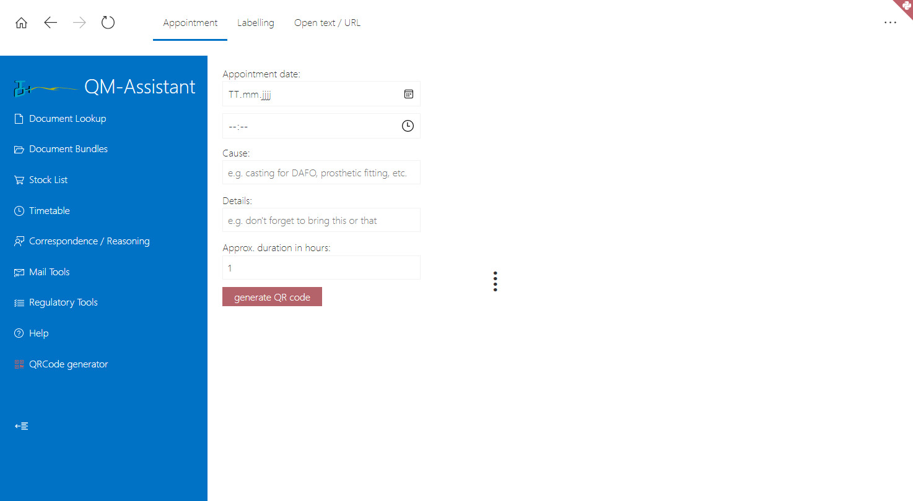
this module is able to generate qr codes for yet to be named possibilities. currently appointments can be generated to be imported into the mobile calendar by the click of the camera. other uses are expected to follow but can be customized within the web code. this module is available within the [python environment](#python-wrapper) only where the python code creates the images and opens them with the default image application. images are stored within the user directory right right beside the assistants settings. although the files can pile up during use they are cleaned up on every application restart. see (comments)[https://github.com/erroronline1/qualitymanagement/blob/master/assistant/pymodules/qr.py] why i considered this the best solution for the moment.

dependencies are: datalist of possible preprocessed outputs.

globalSearch api: returns submodules where titles match the search terms.

[back to top](#table-of-contents)

## structure
please adhere to the modules structure. each module consists of an object with properties and methods.

somemodule.js
```Javascript
var somemodule = {
	var: {}, // will be overwritten by the imported *.var.js-file
	data: {}, // will be overwritten by the imported *.data.js-file
	/* other module specific properties may apply */
	api: {
		available: async (search) => {
			// return applicable values to global search - in case of active search
			core.globalSearch.contribute('somemodule', [somecontent, relevance]);
		},
		currentStatus: async () => {
			// return applicable values to global search - in case of passive start screen status
		}
	},
	fn: {
		search: async (query = '') => {
			// return applicable values to stdout
		},
		/* ...
		other module specific functions may apply
		... */
		init: async (query = '') => {
			// create modules start screen
			await core.fn.async.stdout('input', somecontent);
			await core.fn.async.stdout('temp', somedifferentcontent);
			await core.fn.async.stdout('output', someothercontent);
		},
		load: async () => {
			// load vars and data 
			await core.fn.async.loadScript(core.var.moduleVarDir + 'somemodule.var.js');
			await core.fn.async.loadScript(core.var.moduleDataDir + 'somemodule.data.js');
		}
	}
};
```

somemodule.var.js
```Javascript
somemodule.var= { //module variables
	someProperty: 'Pi is exactly 3',
	lang: {
		inputPlaceholder: {
			en: 'Search for last digit of pi',
			de: 'Suche die letzte Stelle von Pi' 
		},
		otherShownText: {
			en: 'Add multi-language-support for all text chunks',
			de: 'Füge Unterstützung für mehrfache Sprachen für alle Text-Blöcke ein'
		}
	},
	//declare false if the output is meant to be copied and should be selected as a whole by clicking into the area
	disableOutputSelect: false,
};
```

somemodule.data.js
```Javascript
somemodule.data= {
	content: [
		'strings',
		['array', 'values'],
		'whatever your module wants to process'
	],
	someOtherProperty: 'whateverIsNeeded'
};
```

algorithms and values are separated and changes on one don´t necessarily affect the other. or copying new content between my companies and this open source version don't overwrite something (that happend way to often). since both parts of module are loaded asynchronously the initialization of the modules object in both files might be reasonable.

please inspect the sample files for further information. while distributing this piece of software there happen to be some differencies between the open source version and the actual software used in my company. the main differencies can be found in the {modulename}.var-properties. maybe you find this suitable for you as well so changes to your sourcecode are way more easy to implement.

[back to top](#table-of-contents)

## core functions
modules must contain functions to generate the modules output. some functions are in the main or dependent scripts like language synthesis, shortened document.getElementByID() or loading remote scripts. make use of the core-object, some things are fairly prepared:

* data handling for inter module communication and storing values
* html-escaping for urls and dynamic mailto:-method
* search algorithm
* language selection
* language synthesis as in replacing customizable keywords in strings
* asynchronous script loading
* insertion of repetitive html-elements (e.g. inputs) 
* insertion of inline svg

all modules are depentent on the main module, only some may have dependencies of other data-files.

[back to top](#table-of-contents)

### output containers
container for output are named 'input', 'temp' and 'output' and can be accessed preferably via `core.fn.async.stdout('input', content)` or `el('input').innerHTML` or whatever.

### registering and loading of modules
register and deregister modules in ROOT/core/config.js so they are accessible and listed and imported on initial start. files to be imported (preferably from the modules load-method) always have to be hardcoded (e.g. dropdown-list) because javascript having no indirect access to local file system (directory-listing etc.). data-objects should be stored in `core.var.moduleDataDir`-folder prefixed with modulename_. therefore these can remain untouched if any changes occur for the main module-file and won't be affected during file-transfers in reviews. modules will be loaded on startup with the load-method as callback.

[back to top](#table-of-contents)

### multi-language support
the language bricks within the modules are to be defined. i recommend the same nesting and pattern than the core language model for easier source reading. within every module the language-blocks have to be filled up according to registered languages to avoid errors of undefined objects. the bricks can be called with `core.fn.static.lang('brickName','modulename')` and will return the block in the selected language.

### language synthesis
the root language model core.fn.languageSynthesis within the file library/core/core.fn.languageSynthesis.js can be extended through assigning an additional property within the module-file for example:

```Javascript
core.fn.languageSynthesis.property={
	registeredlanguage_1:['child male form', 'child female form', 'adult male form', 'adult female form'],
	registeredlanguage_2:['child male form', 'child female form', 'adult male form', 'adult female form']
	};
core.fn.languageSynthesis.anotherproperty={
	registeredlanguage_1:function(){/*todo*/ return value;},
	registeredlanguage_2:function(){/*todo*/ return value;},
	);
```

the former object structure absolutely makes sense in german. in english not really though but it is implemented that way, so if you want to reduce that you will have to make changes to the processing as well. you can make use of these properties by processing strings as e.g.

```javascript
'this is a text where the term $property$ will be replaced.'.replace(/\$(\w+?)\$/ig,function(match,group1){return core.fn.languageSynthesis.output(group1)});
```

the method handles the decision over values or functions on its own.

[back to top](#table-of-contents)

### smart search with fuzzy search
this method has to be handed over the raw query string and an object containing the searchable data. it then splits the query into whitespace separated terms, divides -filters and adds a concatenated query to an array of query options. fuzzy search is optional and can be enabled from the settings. if the query bits are set up the dataset will be checked for occurences of every bit. the results is a multidimensional array that can be displayed first in order of occurrences of different terms (if there are more than one) then of the data object. + will make mathing of all search terms mandatory, ? and * will override disabled fuzzy setting, so not really serving as wildcards but giving most probably more relevant results to users that are used to working with these. quoted terms will be looked for in this particular order strictly adding relevance.

[back to top](#table-of-contents)

### output usage
output text is selected on click by default. to avoid this add a property `disableOutputSelect = true;` to module.var. this is considered not to be implemented global through registered-modules for being dynamically mutable if desired within the module itself (e.g. see mailtools).

### inter-module communication
communication between modules is possible with use of `core.fn.async.memory`-methods. this has to be observed strictly, because of possible failures and dependencies of js-data-files. there might be spaghetti! always make sure to have proper default and error handling in case of missing data. initiating functions of submodules partially accept queries to handle preselections.

### api
every module has to contain an api-method that returns some value (at least a `return;`). the api-module is called by the global search from the start site. lack of the api will result in errors. every registered module will be called even if the user has deselected it in the settings (so the user might get a feeling of content and meaning of modules and has a guaranteed meaningful access).

[back to top](#table-of-contents)

## core overview
a shortened overview of recuring used core-functions that can be made use of in future modules (not the complete list though). these are ordered by being static or asynchronous for easier comprehension of structures within any given function, method, whatever. 

### core.js
`el(v)` returns document.getElementById(v)

`core.fn.static`
* `.drm` methods for hash- and token-creation and translation given special rights within modules
* `.dynamicMailto(address, subject, body)` prefills mailto:-actions, opens mail-client and handles browser dependent maximum body size
* `.escapeHTML(text, br2nl)` returns a string with escaped special chars for mailto anchors
* `.insert` methods for recurring design and content patterns including `.checkbox(...)`, `.expand()`, `.icon(...)`, `.limitBar(...)`, `radio(...)` and `.select(...)`
* `.lang(block, args)` looks for properties oder property-functions within core or loaded module to return dependent on the chosen language. block is the property name of the to be displayed text block, args is optional for functions. module properties come before core properties.
* `.languageSelection(event)` returns a set of radio inputs based on registered languages. event is optional and can be e.g. an onchange property of the radio button
* `.limitBar(actual, max, id)` updates given limitBar with actual amount and handles colour style
* `.maxMailSize()` tests whether the browser can handle the maximum body size for maito according to advanced settings
* `.popup(text)` shows or updates a popup box if text is provided, hides it if function called with undefined value
* `.selectText(element)` selection of content in element if not disabled. opens in new window if set so
* `.sortBySecondColumn(a, b)` sorts two dimensional arrays as parameter for sort()
* `.string` with `compress(...)` and `decompess(...)` returns an lzh-compressed or reverted string to occasionally save some bytes for storage of long strings. this uses [the magnificent library by pieroxy](https://github.com/pieroxy/lz-string).
* `.toggleHeight(toggleel)` toggles the class list of given element to expand or shrink it

async functions rely on other async functions at some time. mostly by reading or writing data.

`core.fn.async`
* `.growlNotif(text)` shows a short notification that hides after a set time if text is provided, hides it if function called with undefined value
* `.file` with `link(...)`and `batch(...)` returns or handles external files
* `.loadscript(url, callback)` appends url-file to the header and calls the callback function. used for importing / loading modules and data-files
* `.memory` handles everything storage-related including reading, writing, deleting and some more.
* `.smartSearch` compares raw user input to objects values and returns an array with matches ordered by relevance/multi matches on multiple query terms. handles optional fuzzy search based on overall application setting. has an included relevance tracker.
* `.stdout(where, what)` serves as a wrapper for output to innerHTML, but can be used for debugging easily by setting/adding 'console' to *where*

other core-functions are 
* `core.init` intitializing the whole application, every module on call and the start-screen
* `core.setup` with relevant settings and creation of different setup-screens
* `core.history` handling back- and forth-navigation during the use of the application
* `core.globalsearch` calling the modules api-methods to retrieve relevant data searched from the home-screen

### ../library/core/core.fn.languageSynthesis.js
extends the core-object with the language synthesis. here you define textblocks that can be switched for $keyword$ within continuous text using the function `core.fn.languageSynthesis.output(block)` called by `'string'.replace(/\$(\w+?)\$/ig,function(match,group1){return core.fn.languageSynthesis.output(group1)})`

[back to top](#table-of-contents)

## python wrapper
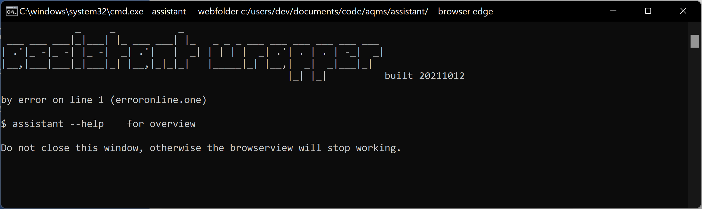
the python wrapper uses [the eel-framework](https://github.com/ChrisKnott/Eel#building-distributable-binary-with-pyinstaller) to start a server and display the assistant tunneling everything through a python backend. this extends some capabilities like storage or is able to fix browser behaviours like opening files instead of storing them like edge 94.
core.eel.js checks for the availability of the wrapper and overrides applicable core methods to use eel-functions instead.
not yet implemented, but if one day there appear random python specific modules, these could be appended to the core.var.modules-list from core.eel.js and will not mess up plain browser usage.


this indicates whether the assistant was lauched using the wrapper


this indicates whether the assistant is launched in plain web wiew

modules have to handle conditional behaviour on their own, respective python implementations require adding to and recompiling assistant.py.

because of the architecture of the framework the core.html file is placed in its own folder and has a cumbersome import-procedure for scripts and styles. on the other hand everything else of the assistant remains accessible and changeable without the need of recompiling the wrapper. this is only necessary on changes on the core.html file itself or on adding python specific modules.

[back to top](#table-of-contents)

# tools
much of the code that is used by the document management happens to be useful for other purposes as well. therefore it is implemented into other excel-files that support your quality management system, planning product and personnel ressources. especially the scripts hopefully make data filtering and selection a bit easier. keep track of declarations of conformity, certificates and other documents from your vendors, make preparing of internal audits an bit easier, keep track of your stock items, plan transfer schedules, use digital time tracking for your employees and handle huge datasets from csv-dumps and populate and update the digital assistant.
occasionally there are some hacks to support your shitty erp-software. some provided office-files act as interfaces between your tracing and the digital assistant.

## vendorlist.xlsm
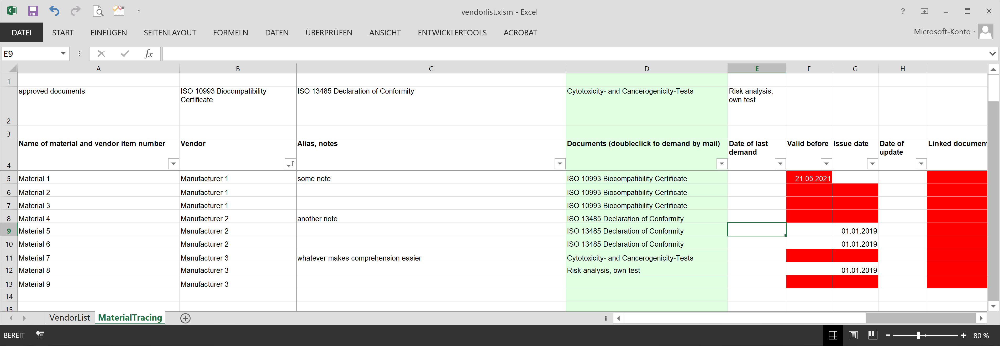

the vendor list helps you keeping track of certificate runtimes and helps you keep in touch with your vendors with a doubleclick by preparing standardized emails while demanding the latest documents. also you can link to documents of proof regarding the fulfillment of regulatory requirements. expiration-dates and unfavourable empty fields are marked with conditional formatting.
you're free to insert anything you want. just the material tracing allows the assignment of listed vendors and approved documents as selected with an automatic updated name-space for vendors and approved document list as stated above the list of materials.

[back to top](#table-of-contents)

## audit planner.xlsm
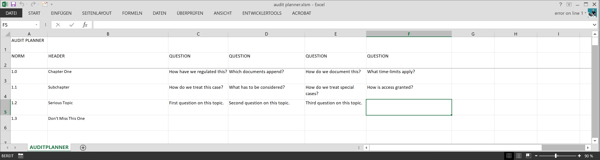

the audit planner can be filled with a question set for internal audits. by exporting the list to the assistant the question set can be used to generate or customize the annual questionnaire (to the relief of the quality manager) and becomes accessible to the employees to reduce obstructions due to regulatory vocabulary.

*please be aware that there are dependencies between column numbers and entries and the assistants filter function. the excel-list will be displayed in the same way within the assistant in the first place.*

[back to top](#table-of-contents)

## stocklist.py
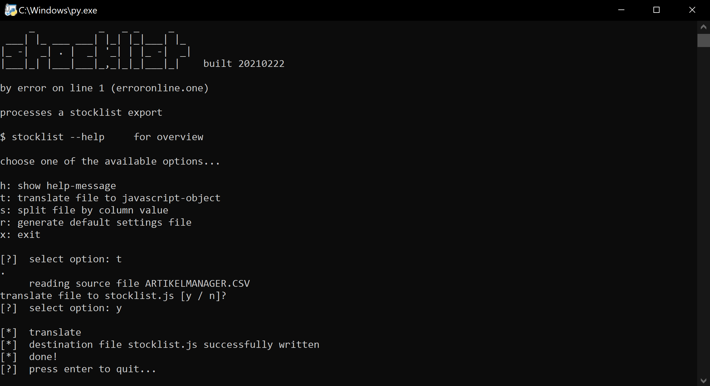
the script translates a dump from the erp-software and makes it accessible and searchable for all employees using the assistant hence optimizing dialogue with inventory control. you will have to customize the json-setup-file and probably compile the python code to an executable that suits your operating system.

also this script has a function to split the data by given column values. this might help e.g. in case of annual stocktaking. this is not related to quality management in the first place but can come in handy and since the same source has to be processed by the same rules, why the heck not?

[back to top](#table-of-contents)

## ticketorder.xlsm
this files purpose is purely for translation. it serves as an interface between your erp-software with item orders and the assistant. basically you can insert any data dump by the erp-software and it translates it to a javascript-object-file as a feedback loop for the stocklist-module within the assistant. it makes sense to contain the generated ticket-ids within the order process in any field that might be dumped by the output. this definitely has an effect on yout order process but might make communication more easy between inventory control and ordering persons.
*be aware that the pattern recognizing regexes in the imported vb_library/administration_Locals_XX.vba rely absolutely on the generated data by your erp-software and have to be customized to your individual situation!*

[back to top](#table-of-contents)

## data rights management.xlsm
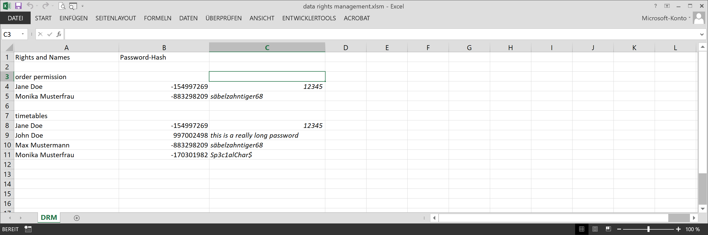

this is a easy to handle list to set optional permissions for modules of the assistant as required. the password hash can be obtained by the assistant directly. no clear passwords are stored - in the image/sample file for illustration purposes though.

[back to top](#table-of-contents)

## transfer schedule.xlsm
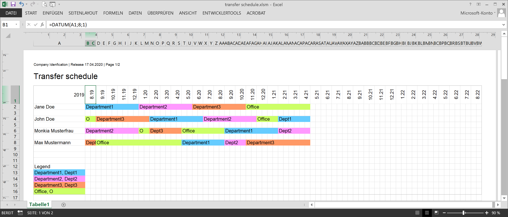

like the [timetables](#timetables) this is not originally part of quality management, but on the other hand which part of operations is not somehow influenced by and influencing quality management itself? making use of the same codebase the transfer schedule originated from the schedule of transferring apprentices through the different departments to get an insight on everything. this might come in handy for other planning operations as well. note that this document is not within the registration process and exporting the table as a pdf-file will only contain a release date, not a version number.

customize the department definitions and abbreviations, everything separated by a non-word-chracter will be recognized to update to your set background-colour. plan the schedule, connect cells and you end up with a decent overview. on saving the background color of the entries as well as the separation lines for entries and months will update and you will be prompted to optional export the file.
change the year as needed, the first month-column contains the initial month value to start from within a formula. adding more sheets is possible, only the active sheet will be processed. position of the term "Legend" (customizable within the Locals module) and placing of the department definitions in column A is crucial.

[back to top](#table-of-contents)

## timetables
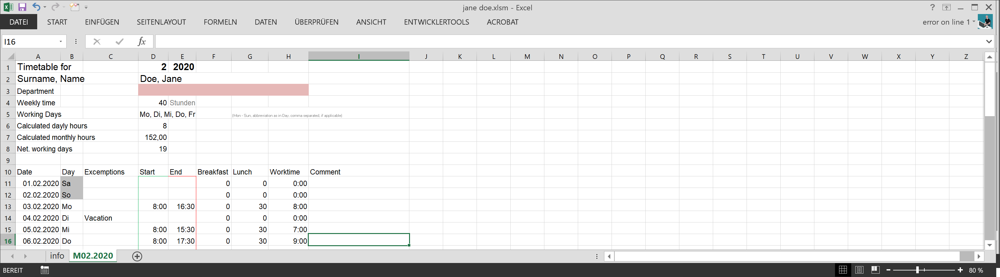

timetracking with excel as an addon. not quite related to quality management in the first place but can come in handy and is implemented in the general process surface of the assistant as well.

### there might be better solutions
if you have efficient electronic supported methods for time tracking of the employees or no need to track working time at all, please carry on!

[more on the timetables code](timetables/)

[back to top](#table-of-contents)

## filter.py
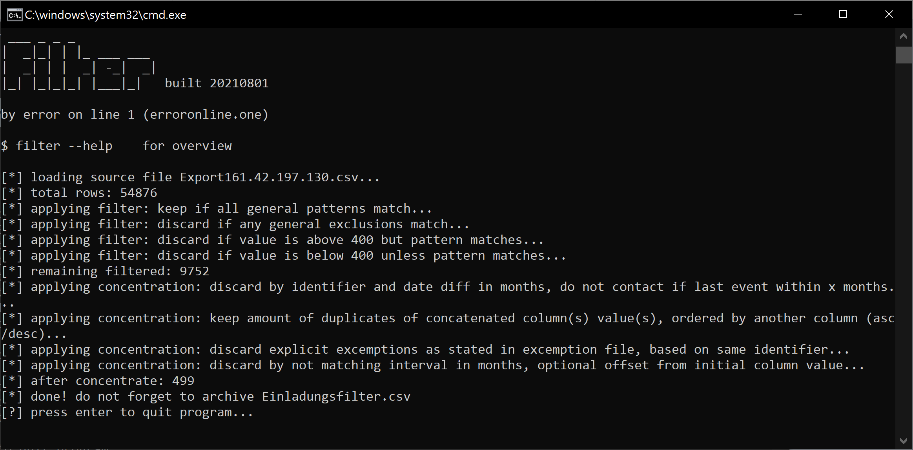

there might be a reccuring need to filter huge data-sets. some erp-software can create csv-dumps of data that can be used for statistics or post market surveillance. it can be way easier to filter these dumps and create a serial letter from the output, than adjust the erps database for an example. with the python filter you can describe filter-patterns with regex for different usecases. you will have to customize the json-setup-file and probably compile the python code to an executable that suits your operating system.

[back to top](#table-of-contents)

## leech.py
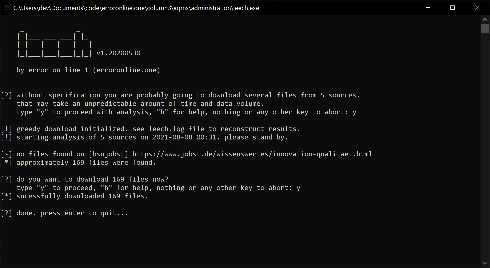

keeping documents of proof up to date, maintain the latest certificates, manuals and technical informations from your vendors can be a difficult task even if you use the vendor-lists inbuild email-function. some vendors just point to their website instead of sending you desired material in the first place. leech.py serves to automatically download files according to linked ressources on websites. it is best used from the command line to have access to further options. this is not ai, you'll have to analyze the inhomogeneous sources by yourself beforehand in order to set up. see help for setup syntax. with the python filter you can describe filter-patterns with regex to find downloadable ressources within the sourcecode of the provided websites. files will be stored in a folder named the vendor-set with the download date. i recommend to handle this file in a different location to not mess up the folder structure. progress will be logged into a separate file to research failures.
you will have to customize the json-setup-file and probably compile the python code to an executable that suits your operating system.

[back to top](#table-of-contents)

# thoughts and considerations
i tried to implement a preview on search forms using datalists. while it is not a big problem to update these dynamically i ran into two major issues: the cross-browser behaviour is very different and quirky. and using this in combination with fuzzy search and 6k+ items in stock-list slows everything horribly down. it would have been nice to have but ended up in some hours wasted.

by 6/20 it is possible to handle special permissions due to the data rights management. this is meant to be as secure as a read-only front-end security system can be. it is absolutely not uncrackable but hopefully a fair amount of obfuscation and obstacles. know your techies in case of abuse.

the assistant is designed to hopefully transition mostly seamlessly into windows 10 fluent design. styling and icon set was selected with this intention. i don't want to collide with foreign rights and hope this will be recognized as the reverence it is intended to be. i am not a fanboy in the first place, although i like microsofts os design. i just try to make it look as native as possible to not disturb the co-workers. it is hard enough to convince them to utilize quality management as well as this tool.

even if the assistant scales itself on smaller screens it is generally not recommended to use it on these (like mobile). some minor features don't even work properly (like tooltips on reduced menu). it's more like a desktop-first-experience...

*funny what can evolute from a personal tool to generate standardized email answers to recurrent enquiries and some messing around with conditional formatting in excel.*

[back to top](#table-of-contents)

## changes and updates
this software is purposed to be adapted to the companies needs in an flexible way. if you find something missing you can add functions quite quick and easily (within technical boundaries). i do exactly this and want to keep the open source distribution updated as well. as long as i am not aware that this software is used by a third party i will push to master and will not implement any version management or branching.

i maintain this open template as well as the official version in my company. while making changes to the program i repeatedly have to consider the individual parts. therefore all custom files are to be found within the library folder. these are seldom a subject of structural changes. most parts are quite dynamic and feed off the data files. customization might not be neccessary. if you do not customize anything within the main files any update from the latest commits should work flawless.

[back to top](#table-of-contents)

## disclaimer
use at your own responsibility. as this system is or has been in real use with me being responsible, i did my best to make everything flawless. i also tried to make the documentation and comments as meaningful as i could. als always there might be parts that once seemed to be self-explanatory so a little bit of advanced javascript and vba skills might come in handy.

this system does neither provide you with the content of your quality management system nor the necessary structure. you will have to set this one up for yourself. but this system might be flexible enough to match your needs in regards of version control, publishing and company wide access. of course i sewed everything to fit my own companies needs and quality management system. if your company decides for more fields you might have to take a deeper look into vba programming to customize that.
but as the current deputy quality manager i strongly recommend to reconsider which type of information and extent your documentation must have to fit the norm.

i was not able to find information if there are special requirements for a quality management software. regarding iso 13485 there are no restrictions what to use. you will have to take your own responsibility for any kind of software - even an amateurs work. you will just have to rate the risk, how to handle that and set up the process of validation of software application for this. as this software supports your paper-based documentation it is up to your own document content, process definitions and reliable form completion by your employees to make sure your qm/documentation meets all regulatory requirements.

[back to top](#table-of-contents)

# license
bottle light quality management software

copyright (c) 2020-2021  [by error on line 1](http://erroronline.one)

This program is free software; you can redistribute it and/or modify it under the terms of the GNU General Public License as published by the Free Software Foundation; either version 3 of the License, or (at your option) any later version. 

This program is distributed in the hope that it will be useful, but WITHOUT ANY WARRANTY; without even the implied warranty of MERCHANTABILITY or FITNESS FOR A PARTICULAR PURPOSE. See the GNU General Public License for more details. 

You should have received a copy of the GNU General Public License along with this program; if not, see [http://www.gnu.org/licenses/](http://www.gnu.org/licenses/).


i am happy to get feedback on code- and documentation-quality since this is my first official open source project.

[back to top](#table-of-contents)